# Universiti Malaya Grant Management System (UM-GMS)
# Comprehensive User Guide & System Manual

**Version**: 1.0
**Date**: March 2026
**System**: Pre-Award Grant Management Module
**University**: Universiti Malaya (UM)

---

## Table of Contents

1. [System Overview](#1-system-overview)
2. [User Roles & Access Levels](#2-user-roles--access-levels)
3. [Getting Started — Registration & Login](#3-getting-started--registration--login)
4. [Dashboard Overview](#4-dashboard-overview)
5. [Module M01 — Pre-Award Setup](#5-module-m01--pre-award-setup)
6. [Module M02 — Grant Setup](#6-module-m02--grant-setup)
7. [Module M03 — Announcements & Grant Calls](#7-module-m03--announcements--grant-calls)
8. [Module M04 — Proposal Preparation](#8-module-m04--proposal-preparation)
9. [Module M05 — Grant Application](#9-module-m05--grant-application)
10. [Module M06 — Proposal Evaluation](#10-module-m06--proposal-evaluation)
11. [Module M07 — Grant Approval](#11-module-m07--grant-approval)
12. [Module M08 — Grant Account Creation](#12-module-m08--grant-account-creation)
13. [Module M09 — Reports & Analytics](#13-module-m09--reports--analytics)
14. [Module M10 — Global Search](#14-module-m10--global-search)
15. [End-to-End Grant Lifecycle](#15-end-to-end-grant-lifecycle)
16. [Notification & Email System](#16-notification--email-system)
17. [Appendix A — Status Reference](#appendix-a--status-reference)
18. [Appendix B — Glossary](#appendix-b--glossary)

---

## 1. System Overview

### 1.1 Purpose

The UM Grant Management System (UM-GMS) is a comprehensive web-based platform designed to manage the complete pre-award grant lifecycle at Universiti Malaya. The system streamlines the process from grant program configuration through application submission, evaluation, approval, and grant account creation.

### 1.2 System Architecture Overview

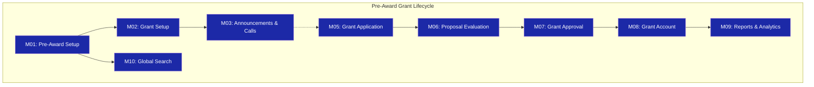
```mermaid
graph TB
    subgraph "Pre-Award Grant Lifecycle"
        M01[M01: Pre-Award Setup] --> M02[M02: Grant Setup]
        M02 --> M03[M03: Announcements & Calls]
        M03 -.-> M05[M05: Grant Application]
        M05 --> M06[M06: Proposal Evaluation]
        M06 --> M07[M07: Grant Approval]
        M07 --> M08[M08: Grant Account]
        M08 --> M09[M09: Reports & Analytics]
        M01 --> M10[M10: Global Search]
    end

    style M01 fill:#1C29A7,color:#fff
    style M02 fill:#1C29A7,color:#fff
    style M03 fill:#1C29A7,color:#fff
    style M05 fill:#1C29A7,color:#fff
    style M06 fill:#1C29A7,color:#fff
    style M07 fill:#1C29A7,color:#fff
    style M08 fill:#1C29A7,color:#fff
    style M09 fill:#1C29A7,color:#fff
    style M10 fill:#1C29A7,color:#fff
```

### 1.3 Key System Features

| Feature | Description |
|---------|-------------|
| **Role-Based Access Control** | Granular permissions with 6 role types |
| **Dynamic Forms** | Admin-configurable application & evaluation forms |
| **Multi-Level Approval** | Sequential approval chain (L1 → L2 → L3) |
| **Email Notifications** | 50+ automated email templates via BullMQ workers |
| **Document Management** | Secure file upload/download via S3/MinIO |
| **Audit Trail** | Complete logging of all system actions |
| **PII Encryption** | AES-256-GCM encryption for sensitive data |
| **UM Branding** | Official Universiti Malaya colours and identity |

### 1.4 Supported Browsers

| Browser | Minimum Version |
|---------|----------------|
| Google Chrome | 100+ |
| Mozilla Firefox | 100+ |
| Microsoft Edge | 100+ |
| Safari | 16+ |

---

## 2. User Roles & Access Levels

### 2.1 Role Hierarchy

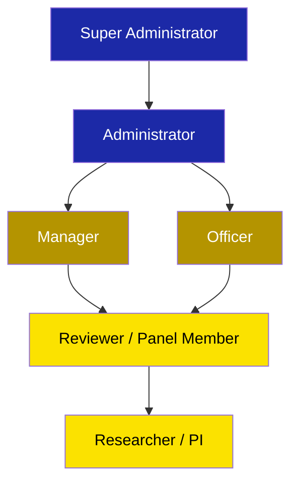
```mermaid
graph TD
    SA[Super Administrator] --> AD[Administrator]
    AD --> MG[Manager]
    AD --> OF[Officer]
    MG --> RV[Reviewer / Panel Member]
    OF --> RV
    RV --> RS[Researcher / PI]

    style SA fill:#1C29A7,color:#fff
    style AD fill:#1C29A7,color:#fff
    style MG fill:#B49400,color:#fff
    style OF fill:#B49400,color:#fff
    style RV fill:#FBE200,color:#000
    style RS fill:#FBE200,color:#000
```

### 2.2 Role Descriptions

| Role | Description | Key Responsibilities |
|------|-------------|---------------------|
| **Super Administrator** | System-wide access | Manage RMCs, roles, permissions, users; full system configuration |
| **Administrator** | Grant management access | Configure grants, manage calls, review applications, assign panels/approvers |
| **Manager** | Program management | Manage announcements, oversee grant programs |
| **Officer** | Administrative operations | Support administrative tasks, process applications |
| **Reviewer / Panel Member** | Evaluation access | Evaluate assigned applications, provide scores and recommendations |
| **Researcher / PI** | Applicant access | Submit proposals/applications, respond to offers, manage grant accounts |

### 2.3 Module Access Matrix

| Module | Super Admin | Admin | Manager | Officer | Reviewer | Researcher/PI |
|--------|:-----------:|:-----:|:-------:|:-------:|:--------:|:-------------:|
| M01 Pre-Award Setup | Full | — | — | — | — | — |
| M02 Grant Setup | Full | Full | Read | Read | — | — |
| M03 Announcements | Full | Full | Full | Full | — | Read |
| M05 Applications | Full | Full | Read | Read | Assigned | Own |
| M06 Evaluation | Full | Full | Read | Read | Assigned | — |
| M07 Approval | Full | Full | Read | Read | — | Own Offers |
| M08 Grant Account | Full | Full | Read | Read | — | Own |
| M09 Reports | Full | Full | — | — | — | — |
| M10 Search | Full | Full | — | — | — | — |

> **Legend**: Full = Create/Read/Update/Delete | Read = View only | Own = Own records only | Assigned = Assigned records only | — = No access

---

## 3. Getting Started — Registration & Login

### 3.1 User Registration Flow

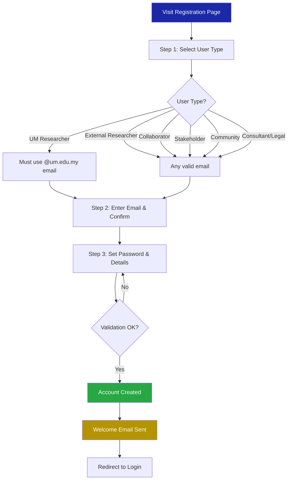
```mermaid
flowchart TD
    A[Visit Registration Page] --> B[Step 1: Select User Type]
    B --> C{User Type?}
    C -->|UM Researcher| D[Must use @um.edu.my email]
    C -->|External Researcher| E[Any valid email]
    C -->|Collaborator| E
    C -->|Stakeholder| E
    C -->|Community| E
    C -->|Consultant/Legal| E
    D --> F[Step 2: Enter Email & Confirm]
    E --> F
    F --> G[Step 3: Set Password & Details]
    G --> H{Validation OK?}
    H -->|No| G
    H -->|Yes| I[Account Created]
    I --> J[Welcome Email Sent]
    J --> K[Redirect to Login]

    style A fill:#1C29A7,color:#fff
    style I fill:#28a745,color:#fff
    style J fill:#B49400,color:#fff
```

#### Step-by-Step Registration

**Step 1 — Select Your Identity**

> 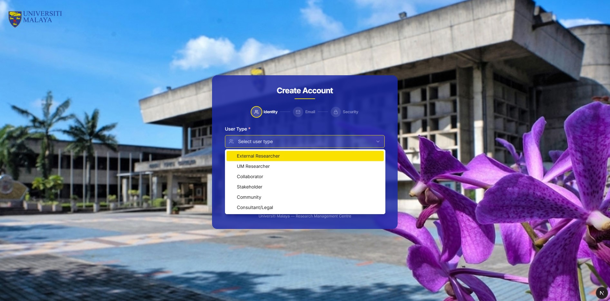
> *Screenshot: Registration page showing the 6 user type cards (UM Researcher, External Researcher, Collaborator, Stakeholder, Community, Consultant/Legal) with descriptions and a "Full Name" input field.*

1. Navigate to the registration page
2. Select your **User Type** from the available options:
   - **UM Researcher** — For Universiti Malaya staff members (requires @um.edu.my email)
   - **External Researcher** — For researchers outside UM
   - **Collaborator** — For research collaborators
   - **Stakeholder** — For grant stakeholders
   - **Community** — For community members
   - **Consultant/Legal** — For external consultants or legal advisors
3. Enter your **Full Name**
4. Click **Next** to proceed

**Step 2 — Enter Your Email**

> 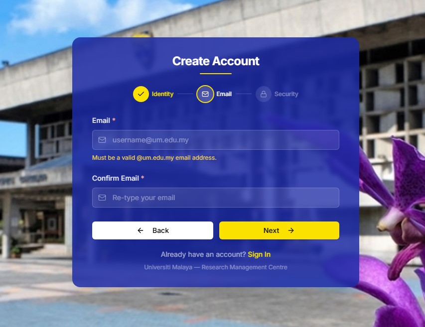
> *Screenshot: Email entry form with email field, email confirmation field, and validation message for UM Researchers showing "@um.edu.my required".*

1. Enter your **Email Address**
   - UM Researchers: Must use your official `@um.edu.my` email
   - Others: Any valid email address
2. **Confirm** your email by entering it again
3. Click **Next** to proceed

**Step 3 — Set Your Password & Profile**

> 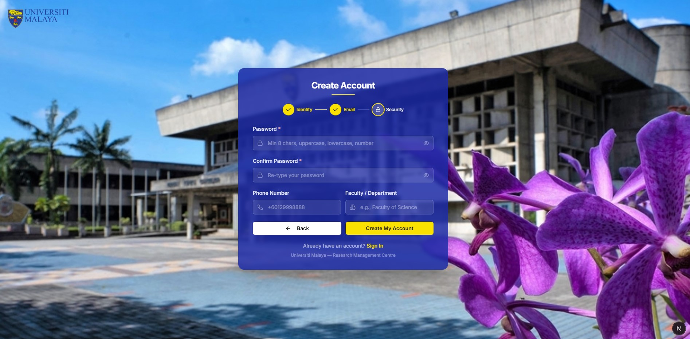
> *Screenshot: Password field with strength indicator, phone number field, institution/faculty dropdown, and password requirements checklist.*

1. Create a **Password** meeting these requirements:
   - Minimum 8 characters
   - At least 1 uppercase letter
   - At least 1 lowercase letter
   - At least 1 number
2. Enter your **Phone Number** (encrypted for security)
3. Select your **Institution/Faculty** (if applicable)
4. Click **Register** to create your account
5. You will receive a **welcome email** and be redirected to the login page

---

### 3.2 Login Flow

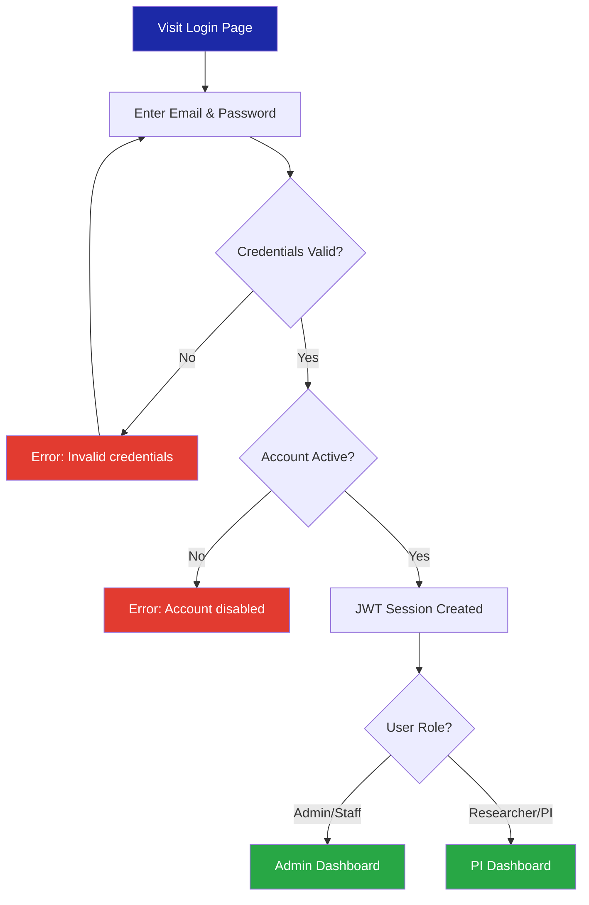
```mermaid
flowchart TD
    A[Visit Login Page] --> B[Enter Email & Password]
    B --> C{Credentials Valid?}
    C -->|No| D[Error: Invalid credentials]
    D --> B
    C -->|Yes| E{Account Active?}
    E -->|No| F[Error: Account disabled]
    E -->|Yes| G[JWT Session Created]
    G --> H{User Role?}
    H -->|Admin/Staff| I[Admin Dashboard]
    H -->|Researcher/PI| J[PI Dashboard]

    style A fill:#1C29A7,color:#fff
    style I fill:#28a745,color:#fff
    style J fill:#28a745,color:#fff
    style D fill:#E23B30,color:#fff
    style F fill:#E23B30,color:#fff
```

> 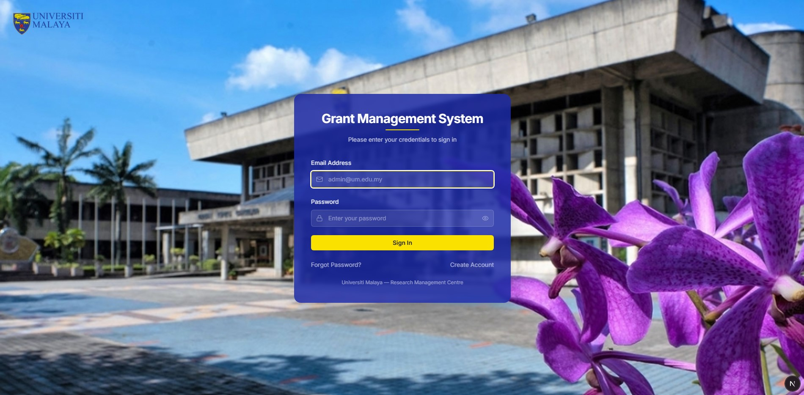
> *Screenshot: Login page with UM branding (blue header, UM logo), email field, password field with show/hide toggle, "Forgot Password?" link, "Sign In" button, and "Register" link.*

1. Navigate to the login page
2. Enter your **Email** and **Password**
3. Click **Sign In**
4. You will be redirected to your **Dashboard** based on your role

---

### 3.3 Password Reset Flow

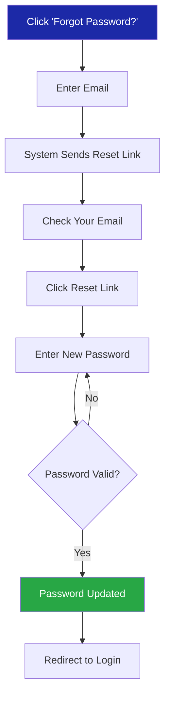
```mermaid
flowchart TD
    A[Click 'Forgot Password?'] --> B[Enter Email]
    B --> C[System Sends Reset Link]
    C --> D[Check Your Email]
    D --> E[Click Reset Link]
    E --> F[Enter New Password]
    F --> G{Password Valid?}
    G -->|No| F
    G -->|Yes| H[Password Updated]
    H --> I[Redirect to Login]

    style A fill:#1C29A7,color:#fff
    style H fill:#28a745,color:#fff
```

> 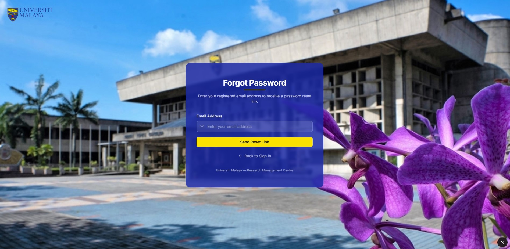
> *Screenshot: Forgot password page with email input field and "Send Reset Link" button.*

1. On the login page, click **"Forgot Password?"**
2. Enter the email associated with your account
3. Click **"Send Reset Link"**
4. Check your email inbox for a password reset link (valid for 1 hour)
5. Click the link and enter your new password
6. You will be redirected to the login page

> **Note**: Password reset is only available for **external users**. UM staff members should use the UM SSO (Single Sign-On) system.

---

## 4. Dashboard Overview

### 4.1 Admin Dashboard

> 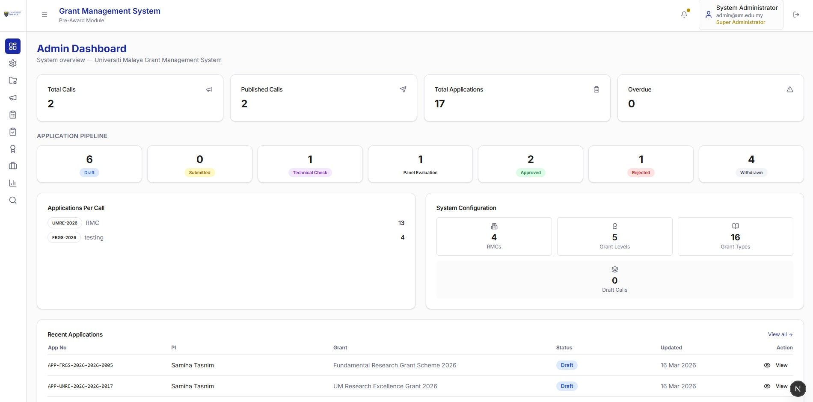
> *Screenshot: Admin dashboard showing 4 overview cards (Total Calls, Published Calls, Applications, Overdue), Application Pipeline bar chart, Applications Per Call chart, and System Configuration summary.*

The Admin Dashboard provides a bird's-eye view of the system:

| Section | Description |
|---------|-------------|
| **System Overview Cards** | Total Calls, Published Calls, Total Applications, Overdue Applications |
| **Application Pipeline** | Bar chart showing application counts by status (Draft, Submitted, Technical Check, Panel Evaluation, Approved, Rejected, Withdrawn) |
| **Applications Per Call** | Top 10 grant calls ranked by number of applications |
| **System Configuration** | Summary of RMCs, Grant Levels, Grant Types, and Draft Calls |
| **Recent Applications** | Table of latest submitted applications |
| **Recent Calls** | Table of recently created/updated grant calls |

---

### 4.2 PI/Researcher Dashboard

> 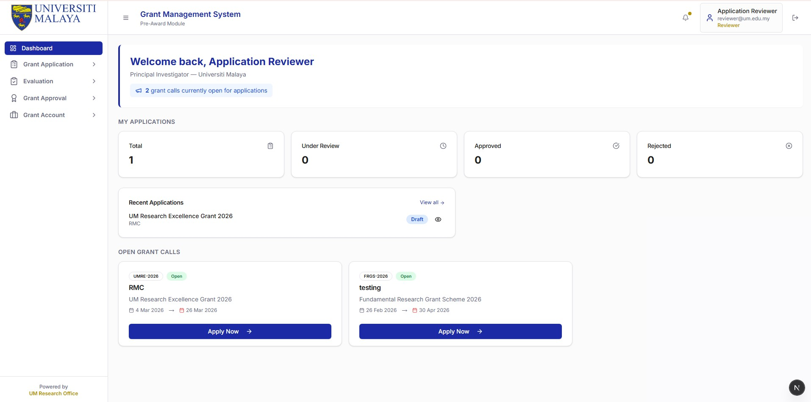
> *Screenshot: PI dashboard showing welcome banner with active call count, My Applications stats (Total, Under Review, Approved, Rejected), Recent Applications list, and Open Grant Calls with "Apply Now" buttons.*

The Researcher Dashboard provides a personalized view:

| Section | Description |
|---------|-------------|
| **Welcome Banner** | Personalized greeting with number of active grant calls |
| **My Application Stats** | Total applications, Under Review, Approved, Rejected |
| **Recent Applications** | Your latest applications with status badges |
| **Open Grant Calls** | Published calls accepting applications with "Apply Now" button |

---

### 4.3 Sidebar Navigation

> 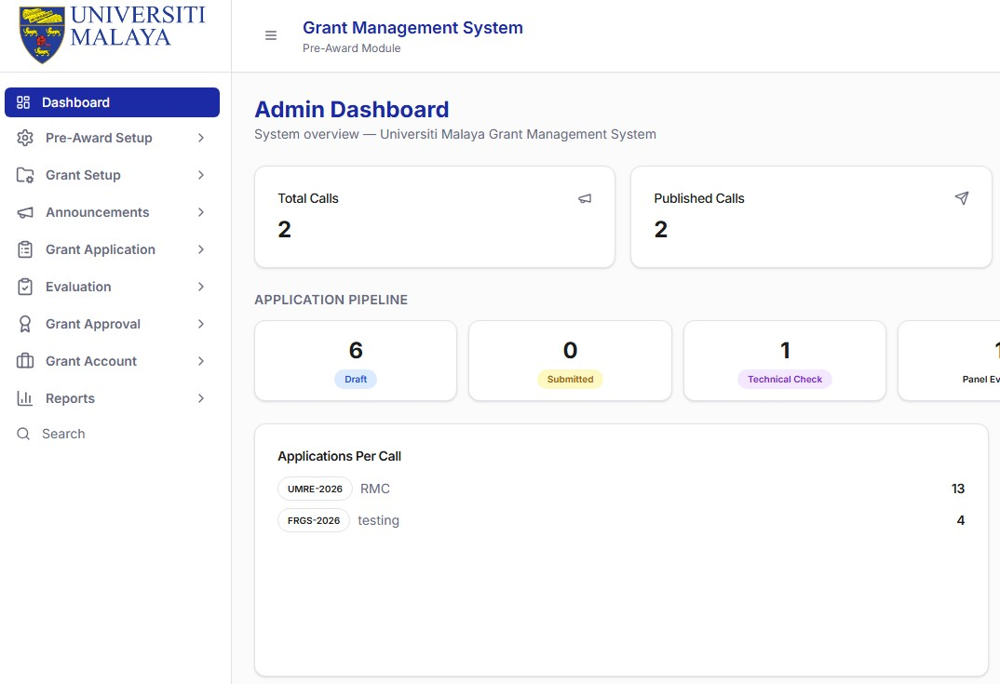
> *Screenshot: Left sidebar showing collapsible menu sections — Dashboard, Pre-Award Setup (M01), Grant Setup (M02), Announcements (M03), Grant Application (M05), Evaluation (M06), Grant Approval (M07), Grant Account (M08), Reports (M09), Search (M10). Sections visible based on user role.*

The sidebar navigation is **role-aware** — you will only see menu items you have access to. Sections expand when clicked to reveal sub-pages.

---

## 5. Module M01 — Pre-Award Setup

### 5.1 Overview

Module M01 is the **foundation** of the GMS system. It allows the Super Administrator to configure the organizational structure, define roles and permissions, manage user accounts, and set up grant classification hierarchies.

> **Access**: Super Administrator only

### 5.2 Module Flow

```mermaid
flowchart LR
    A[Create RMCs] --> B[Define Roles]
    B --> C[Assign Permissions]
    C --> D[Create Administrators]
    D --> E[Define Grant Levels]
    E --> F[Define Grant Types]
    F --> G[M01 Complete ✓]

    style A fill:#1C29A7,color:#fff
    style B fill:#1C29A7,color:#fff
    style C fill:#1C29A7,color:#fff
    style D fill:#1C29A7,color:#fff
    style E fill:#1C29A7,color:#fff
    style F fill:#1C29A7,color:#fff
    style G fill:#28a745,color:#fff
```

---

### 5.3 RMC Management

**Purpose**: Create and manage Research Management Centres (organizational units such as Faculties and Research Centres).

> 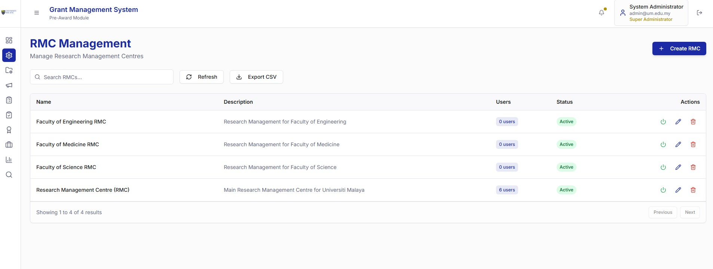
> *Screenshot: RMC list page showing a table with columns: Name, Description, Status (Active/Inactive badge), Users Count, Actions (Edit, Toggle, Delete). "Create RMC" button at top right. Search bar above table.*

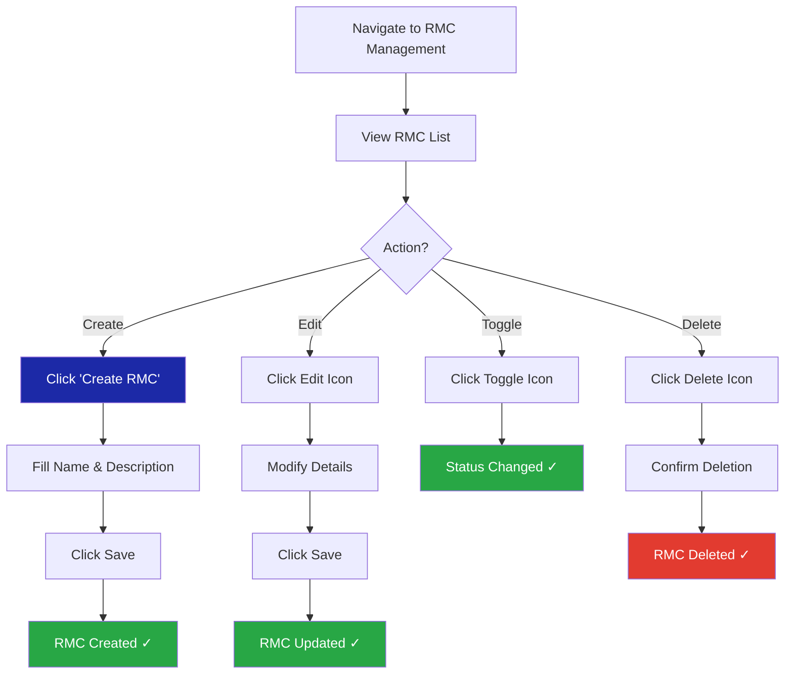
```mermaid
flowchart TD
    A[Navigate to RMC Management] --> B[View RMC List]
    B --> C{Action?}
    C -->|Create| D[Click 'Create RMC']
    D --> E[Fill Name & Description]
    E --> F[Click Save]
    F --> G[RMC Created ✓]
    C -->|Edit| H[Click Edit Icon]
    H --> I[Modify Details]
    I --> J[Click Save]
    J --> K[RMC Updated ✓]
    C -->|Toggle| L[Click Toggle Icon]
    L --> M[Status Changed ✓]
    C -->|Delete| N[Click Delete Icon]
    N --> O[Confirm Deletion]
    O --> P[RMC Deleted ✓]

    style D fill:#1C29A7,color:#fff
    style G fill:#28a745,color:#fff
    style K fill:#28a745,color:#fff
    style M fill:#28a745,color:#fff
    style P fill:#E23B30,color:#fff
```

#### How to Create an RMC

> 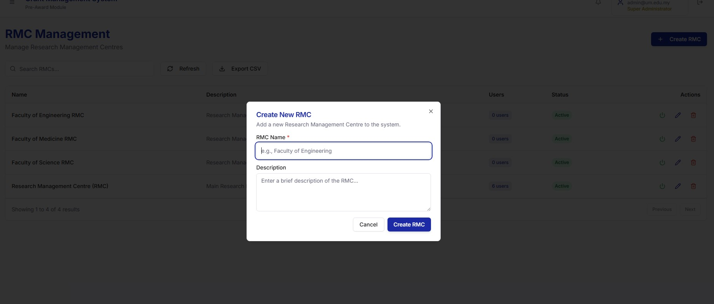
> *Screenshot: Modal dialog with title "Create New RMC", input fields for Name and Description (textarea), Cancel and Create buttons.*

1. Navigate to **Pre-Award Setup → RMC Management**
2. Click **"Create RMC"** button (top-right)
3. In the dialog:
   - Enter the **RMC Name** (e.g., "Faculty of Computer Science & IT")
   - Enter a **Description** (optional)
4. Click **"Create"**
5. A success toast will appear confirming the RMC has been created

#### How to Edit an RMC

1. Find the RMC in the list table
2. Click the **Edit** (pencil) icon in the Actions column
3. Modify the **Name** and/or **Description**
4. Click **"Save"**

#### How to Activate/Deactivate an RMC

1. Click the **Toggle** icon (power button) in the Actions column
2. The status badge will change between **Active** (green) and **Inactive** (grey)

---

### 5.4 Roles Management

**Purpose**: Define system roles that determine what users can do in the system.

> 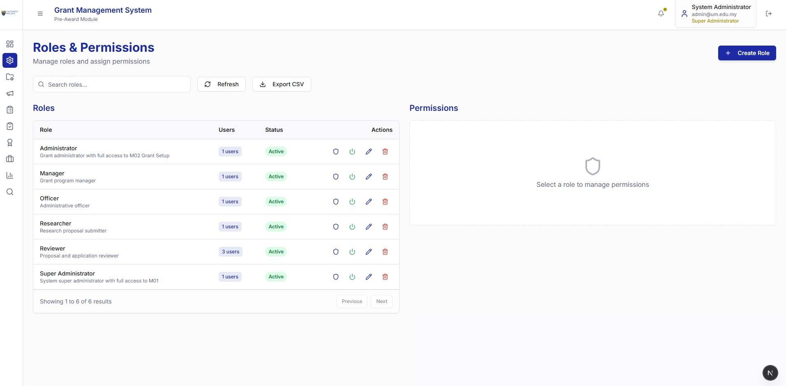
> *Screenshot: Split-panel layout. Left panel: Roles list with Name, Status, User Count columns. Right panel: Permission Matrix showing grouped permissions with Create/Read/Update/Delete checkboxes per permission row. "Create Role" button at top.*

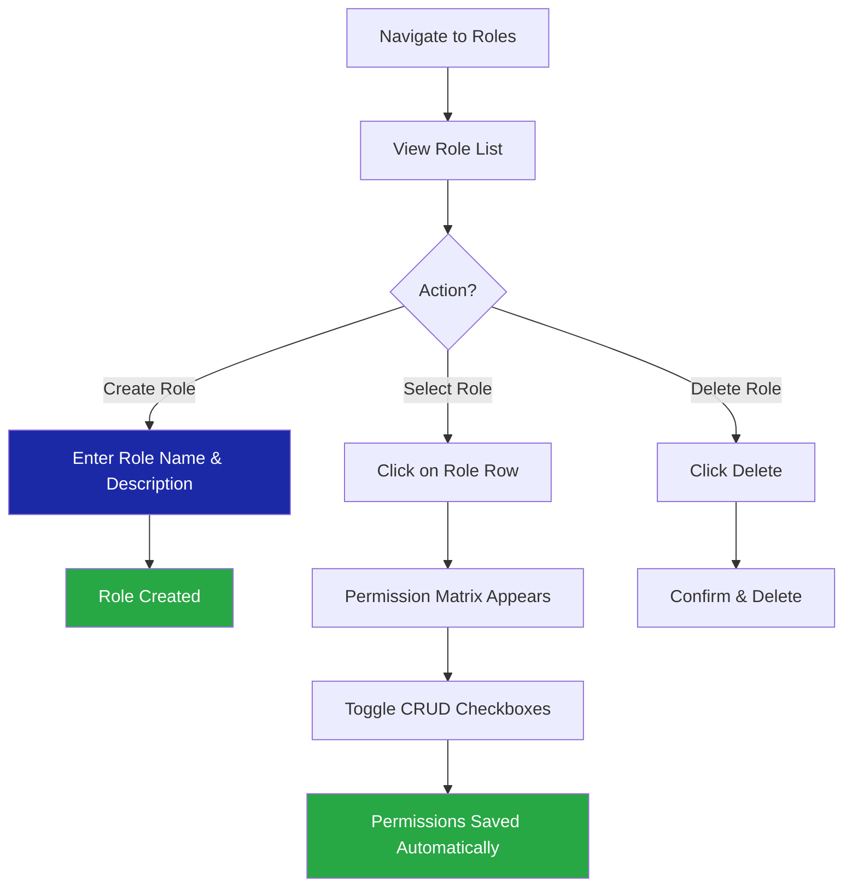
```mermaid
flowchart TD
    A[Navigate to Roles] --> B[View Role List]
    B --> C{Action?}
    C -->|Create Role| D[Enter Role Name & Description]
    D --> E[Role Created]
    C -->|Select Role| F[Click on Role Row]
    F --> G[Permission Matrix Appears]
    G --> H[Toggle CRUD Checkboxes]
    H --> I[Permissions Saved Automatically]
    C -->|Delete Role| J[Click Delete]
    J --> K[Confirm & Delete]

    style D fill:#1C29A7,color:#fff
    style E fill:#28a745,color:#fff
    style I fill:#28a745,color:#fff
```

#### How to Create a Role

1. Navigate to **Pre-Award Setup → Roles**
2. Click **"Create Role"**
3. Enter the **Role Name** (e.g., "Grant Coordinator") and optional **Description**
4. Click **"Create"**

#### How to Assign Permissions to a Role

> 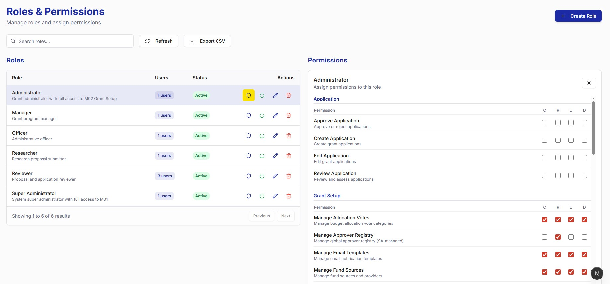
> *Screenshot: Close-up of the permission matrix showing permission groups (Grant Setup, Application, Evaluation, etc.) with expandable rows. Each permission has 4 checkboxes: Create, Read, Update, Delete. Selected checkboxes shown in blue.*

1. Click on a **Role** in the left panel
2. The **Permission Matrix** appears on the right
3. Permissions are grouped by category (e.g., "Grant Setup", "Application", "Evaluation")
4. For each permission, toggle the checkboxes:
   - **Create** — Can create new records
   - **Read** — Can view records
   - **Update** — Can modify records
   - **Delete** — Can remove records
5. Changes are saved **automatically** when you toggle a checkbox

---

### 5.5 Permissions Management

**Purpose**: Create and manage granular permissions that can be assigned to roles.

> 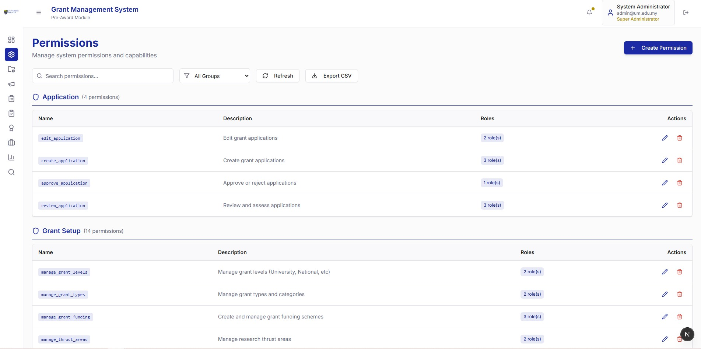
> *Screenshot: Permissions list with columns: Permission Name, Group, Description, Status. Filter dropdown for Group. "Create Permission" button.*

#### How to Create a Permission

1. Navigate to **Pre-Award Setup → Permissions**
2. Click **"Create Permission"**
3. Fill in:
   - **Permission Name** (e.g., "manage_grant_funding")
   - **Group** (e.g., "Grant Setup") — used for organizing in the matrix
   - **Description** (e.g., "Manage grant funding programs")
4. Click **"Create"**

---

### 5.6 Administrators Management

**Purpose**: Create and manage system user accounts with role and RMC assignments.

> 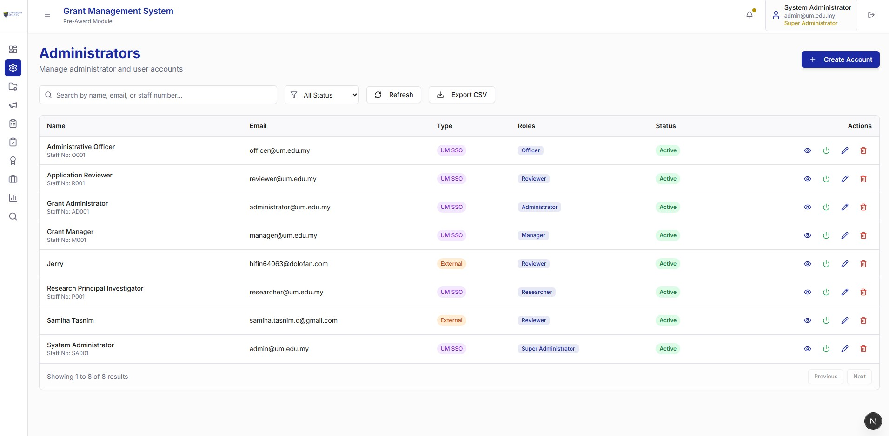
> *Screenshot: User list table with columns: Name, Email, Staff No, RMC, Roles (badge list), Status (Active/Inactive), Actions (Edit, Toggle, Delete, Reset Password). Search bar and "Create User" button.*

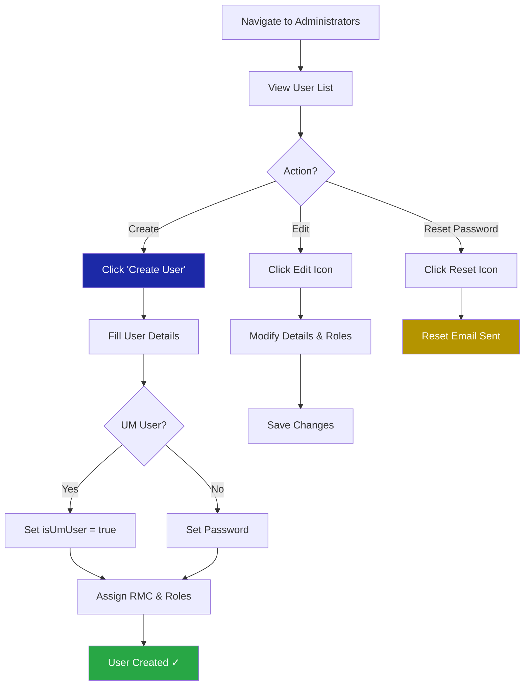
```mermaid
flowchart TD
    A[Navigate to Administrators] --> B[View User List]
    B --> C{Action?}
    C -->|Create| D[Click 'Create User']
    D --> E[Fill User Details]
    E --> F{UM User?}
    F -->|Yes| G[Set isUmUser = true]
    F -->|No| H[Set Password]
    G --> I[Assign RMC & Roles]
    H --> I
    I --> J[User Created ✓]
    C -->|Edit| K[Click Edit Icon]
    K --> L[Modify Details & Roles]
    L --> M[Save Changes]
    C -->|Reset Password| N[Click Reset Icon]
    N --> O[Reset Email Sent]

    style D fill:#1C29A7,color:#fff
    style J fill:#28a745,color:#fff
    style O fill:#B49400,color:#fff
```

#### How to Create a User

> 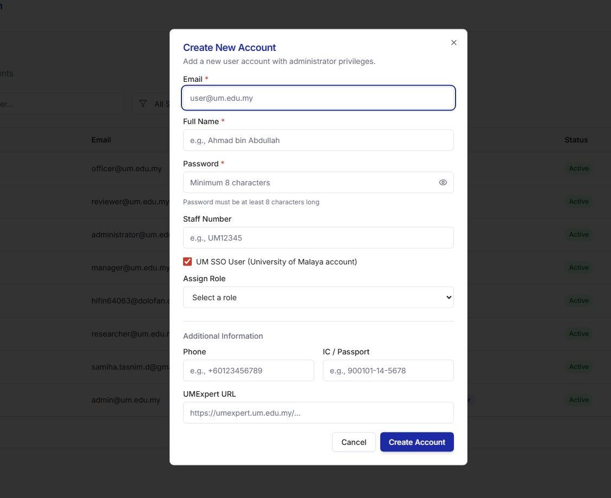
> *Screenshot: Modal dialog with fields: Name, Email, Staff Number, IC/Passport (encrypted), Phone (encrypted), Is UM User toggle, Password (if not UM user), RMC dropdown, Roles multi-select.*

1. Navigate to **Pre-Award Setup → Administrators**
2. Click **"Create User"**
3. Fill in the user details:
   - **Name** — Full name
   - **Email** — User's email address
   - **Staff Number** — University staff number (if applicable)
   - **IC/Passport** — Identity document number (encrypted at rest)
   - **Phone** — Contact number (encrypted at rest)
   - **Is UM User** — Toggle ON for UM staff, OFF for external users
   - **Password** — Required for external users (UM users use SSO)
   - **RMC** — Select the user's Research Management Centre
   - **Roles** — Select one or more roles
4. Click **"Create"**

> **Security Note**: IC/Passport numbers and phone numbers are encrypted using AES-256-GCM encryption and are displayed masked (last 4 digits only).

---

### 5.7 Grant Levels

**Purpose**: Define the classification hierarchy for grants.

> 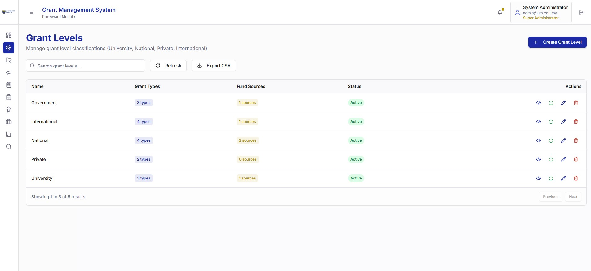
> *Screenshot: Grant levels list showing 4 levels — University, National, Private, International — with descriptions, status badges, and grant type counts.*

The system supports **4 standard grant levels**:

| Level | Code | Description |
|-------|------|-------------|
| University | INT | Internal UM grants |
| National | NAT | Malaysian government grants |
| Private | PVT | Private sector / industry grants |
| International | INTL | International grants |

---

### 5.8 Grant Types

**Purpose**: Define grant types under each level (e.g., Government, Industry, Academic under National).

> 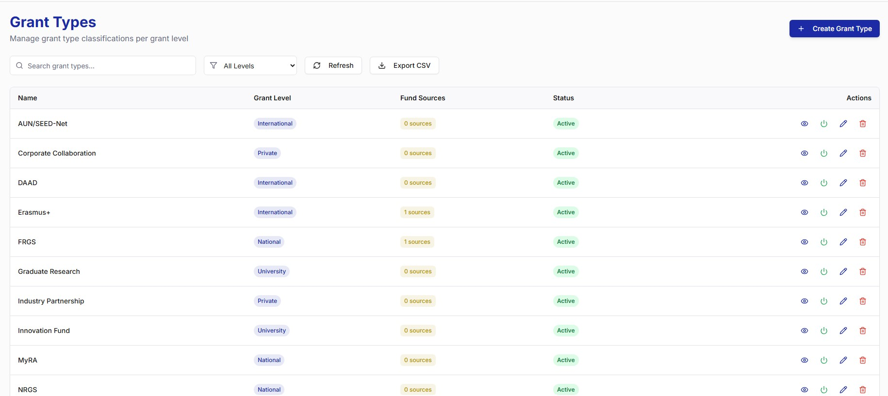
> *Screenshot: Grant types page with a tree view showing Level → Type hierarchy. Each type has Name, Description, Status, and Fund Source count.*

---

## 6. Module M02 — Grant Setup

### 6.1 Overview

Module M02 is the **heart of grant configuration**. Administrators use it to set up everything a grant program needs before calls can be created — from funding sources and research taxonomies to application forms, evaluation rubrics, email templates, and approval chains.

> **Access**: Administrator and Super Administrator

### 6.2 Module Flow

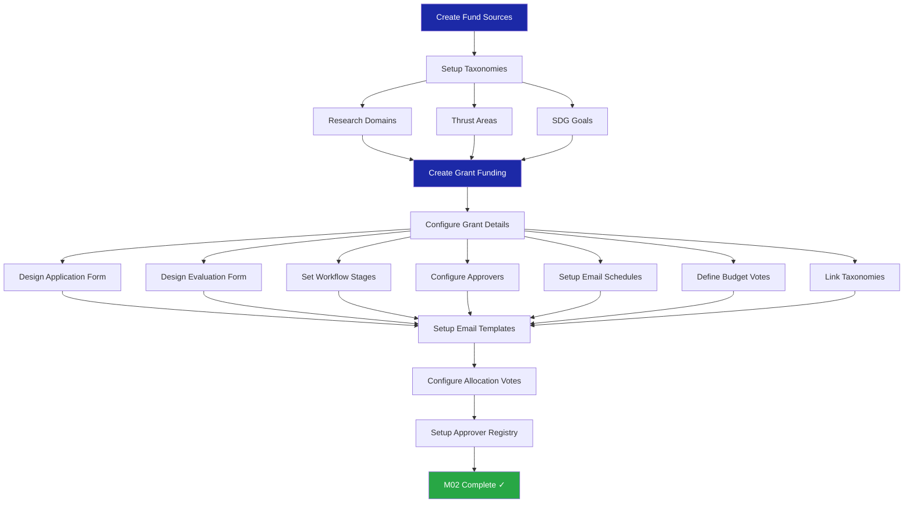
```mermaid
flowchart TD
    A[Create Fund Sources] --> B[Setup Taxonomies]
    B --> B1[Research Domains]
    B --> B2[Thrust Areas]
    B --> B3[SDG Goals]
    B1 & B2 & B3 --> C[Create Grant Funding]
    C --> D[Configure Grant Details]
    D --> D1[Design Application Form]
    D --> D2[Design Evaluation Form]
    D --> D3[Set Workflow Stages]
    D --> D4[Configure Approvers]
    D --> D5[Setup Email Schedules]
    D --> D6[Define Budget Votes]
    D --> D7[Link Taxonomies]
    D1 & D2 & D3 & D4 & D5 & D6 & D7 --> E[Setup Email Templates]
    E --> F[Configure Allocation Votes]
    F --> G[Setup Approver Registry]
    G --> H[M02 Complete ✓]

    style A fill:#1C29A7,color:#fff
    style C fill:#1C29A7,color:#fff
    style H fill:#28a745,color:#fff
```

---

### 6.3 Fund Sources

**Purpose**: Register funding agencies and sources for grants.

> ![Screenshot Placeholder: Fund Sources Page]
> *Screenshot: Fund sources list with columns: Name, Description, Grant Level, Grant Type, Status, Actions. "Create Fund Source" button.*

1. Navigate to **Grant Setup → Fund Sources**
2. Click **"Create Fund Source"**
3. Select the **Grant Level** and **Grant Type**
4. Enter the **Fund Source Name** and **Description**
5. Click **"Create"**

---

### 6.4 Research Taxonomies

#### Research Domains

> ![Screenshot Placeholder: Research Domains Page]
> *Screenshot: Research domains list with expandable rows showing sub-domains. Example: "Computer Science" expanded to show "Artificial Intelligence", "Cybersecurity", "Data Science" sub-domains.*

**Purpose**: Define research classification domains and sub-domains that researchers select when applying for grants.

#### Thrust Areas

> ![Screenshot Placeholder: Thrust Areas Page]
> *Screenshot: Thrust areas list showing 10 UM research thrust areas with descriptions and status toggles.*

**Purpose**: Configure Universiti Malaya's strategic research thrust areas (e.g., AI & Robotics, Nuclear Technology, Medical Sciences).

#### SDG Goals

> ![Screenshot Placeholder: SDG Goals Page]
> *Screenshot: SDG Goals grid showing all 17+1 UN Sustainable Development Goals with official icons, names, and status toggles.*

**Purpose**: Manage the UN Sustainable Development Goals that can be linked to grant programs.

---

### 6.5 Grant Funding — The Core Configuration Hub

**Purpose**: Create and fully configure grant funding programs. This is the most complex entity in M02, containing 7 sub-resource tabs.

> 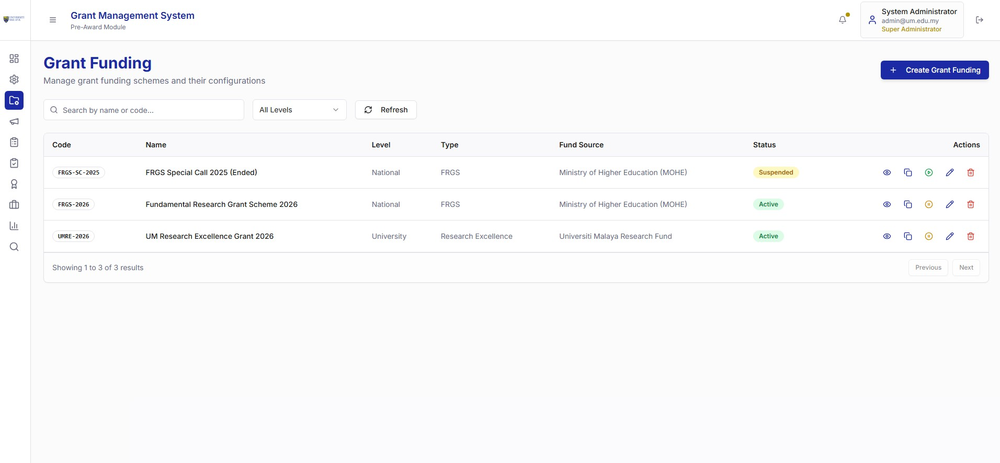
> *Screenshot: Grant funding list with columns: Name, Grant Code, Level, Type, Fund Source, Status (Active/Suspended), Applications Count, Actions (View, Edit, Duplicate, Suspend, Delete).*

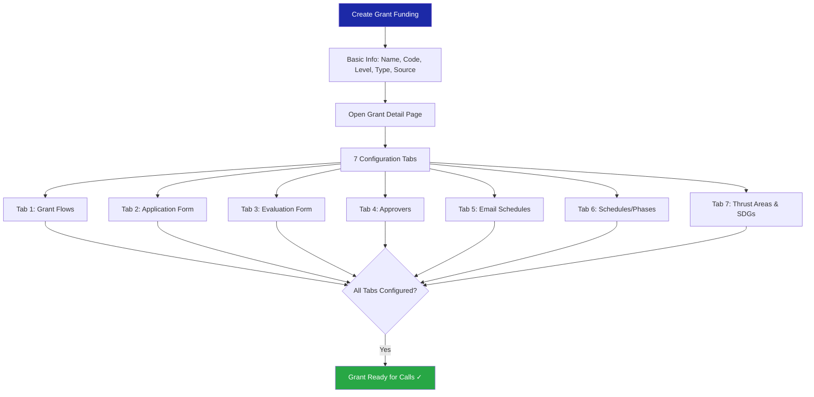
```mermaid
flowchart TD
    A[Create Grant Funding] --> B[Basic Info: Name, Code, Level, Type, Source]
    B --> C[Open Grant Detail Page]
    C --> D[7 Configuration Tabs]
    D --> T1[Tab 1: Grant Flows]
    D --> T2[Tab 2: Application Form]
    D --> T3[Tab 3: Evaluation Form]
    D --> T4[Tab 4: Approvers]
    D --> T5[Tab 5: Email Schedules]
    D --> T6[Tab 6: Schedules/Phases]
    D --> T7[Tab 7: Thrust Areas & SDGs]

    T1 --> E{All Tabs Configured?}
    T2 --> E
    T3 --> E
    T4 --> E
    T5 --> E
    T6 --> E
    T7 --> E
    E -->|Yes| F[Grant Ready for Calls ✓]

    style A fill:#1C29A7,color:#fff
    style F fill:#28a745,color:#fff
```

#### How to Create a Grant Funding

> 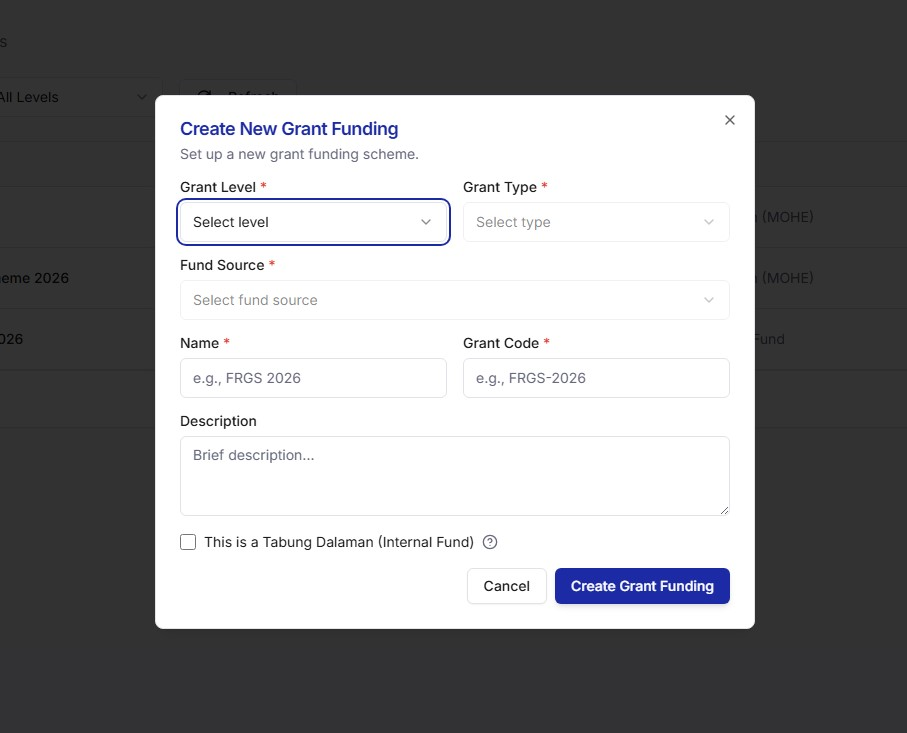
> *Screenshot: Modal with fields: Grant Name, Grant Code (alphanumeric), Grant Level dropdown, Grant Type dropdown, Fund Source dropdown, Description textarea.*

1. Navigate to **Grant Setup → Grant Funding**
2. Click **"Create Grant Funding"**
3. Fill in:
   - **Grant Name** — Full name of the grant program
   - **Grant Code** — Unique identifier (e.g., "UMRG-2026")
   - **Grant Level** — Select from University/National/Private/International
   - **Grant Type** — Select the type within the chosen level
   - **Fund Source** — Select the funding agency
4. Click **"Create"**
5. You will be taken to the **Grant Detail Page** with 7 tabs

---

#### Tab 1: Grant Flows (Workflow Stages)

> ![Screenshot Placeholder: Grant Flows Tab]
> *Screenshot: Timeline/workflow view showing stages: Application → Technical Check → Panel Evaluation → Approval. Each stage has a name, duration (in days), and order number.*

**Purpose**: Define the workflow stages that applications pass through. [CURRENTLY NOT IMPLEMENTED TO FOLLOW THE WORKFLOW]

1. Click **"Add Stage"**
2. For each stage, configure:
   - **Stage Name** (e.g., "Technical Check", "Panel Evaluation")
   - **Duration** — Number of days allocated for this stage
   - **Order** — Sequence number
3. Click **"Save"**

---

#### Tab 2: Application Form (Dynamic Form Builder)

> 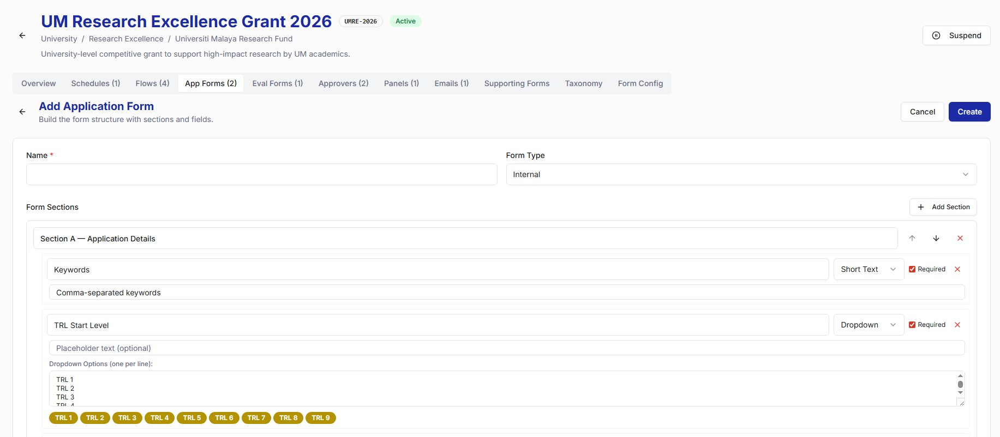
> *Screenshot: Form builder interface showing sections (A: General Information, B: Research Information, C: Team Members, etc.) with draggable fields. Each field has type (text, textarea, select, file), required toggle, and validation settings.*

**Purpose**: Design the application form that PIs will fill out when applying for this grant.

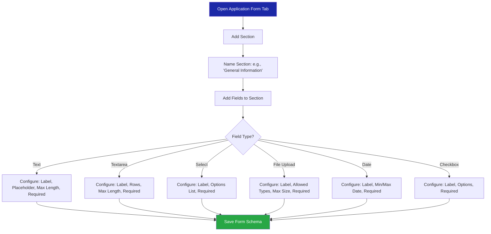
```mermaid
flowchart TD
    A[Open Application Form Tab] --> B[Add Section]
    B --> C[Name Section: e.g., 'General Information']
    C --> D[Add Fields to Section]
    D --> E{Field Type?}
    E -->|Text| F[Configure: Label, Placeholder, Max Length, Required]
    E -->|Textarea| G[Configure: Label, Rows, Max Length, Required]
    E -->|Select| H[Configure: Label, Options List, Required]
    E -->|File Upload| I[Configure: Label, Allowed Types, Max Size, Required]
    E -->|Date| J[Configure: Label, Min/Max Date, Required]
    E -->|Checkbox| K[Configure: Label, Options, Required]
    F & G & H & I & J & K --> L[Save Form Schema]

    style A fill:#1C29A7,color:#fff
    style L fill:#28a745,color:#fff
```

1. Click **"Add Section"** to create form sections (A, B, C, etc.)
2. Within each section, click **"Add Field"**
3. Configure each field:
   - **Label** — Field display name
   - **Type** — text, textarea, email, date, file, select, checkbox
   - **Required** — Toggle ON/OFF
   - **Validation** — max length, email format, etc.
4. Click **"Save Form"**

---

#### Tab 3: Evaluation Form (Scoring Rubric)

> 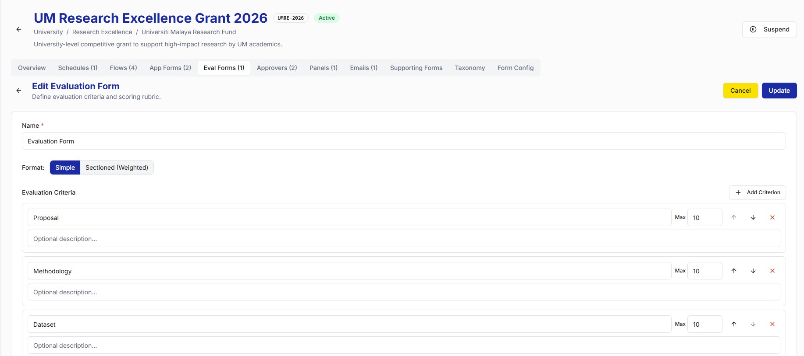
> *Screenshot: Evaluation form builder with weighted sections. Example: Section "Research Quality" (Weight: 30%) with criteria: Novelty (Max: 10), Methodology (Max: 15), Impact (Max: 10). Total section max = 35.*

**Purpose**: Design the evaluation scoring rubric that panel members will use.

1. Click **"Add Section"**
2. For each section:
   - **Section Name** (e.g., "Research Quality", "Budget Justification")
   - **Weight** — Percentage weight (all sections must total 100%)
3. Within each section, add **Criteria**:
   - **Criterion Name** (e.g., "Novelty of Research")
   - **Max Score** — Maximum points for this criterion
4. Click **"Save"**

> **Scoring Calculation**:
> - Section % = (Sum of Scores ÷ Sum of Max Scores) × 100
> - Weighted Score = Sum of (Section % × Section Weight ÷ 100)

---

#### Tab 4: Approvers

> 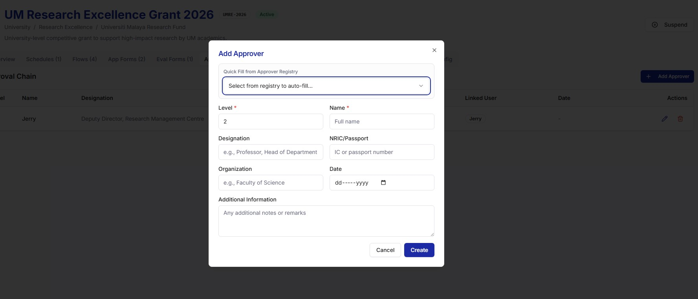
> *Screenshot: Approval chain configuration showing Level 1 (HOD), Level 2 (Dean), Level 3 (DVC) with assigned approver names and RMC associations.*

**Purpose**: Define the multi-level approval chain for this grant.

1. Click **"Add Approver Level"**
2. Select **Approver** from the registry
3. Set the **Level** (L1, L2, L3...)
4. Click **"Save"**

---

#### Tab 5: Email Schedules

> 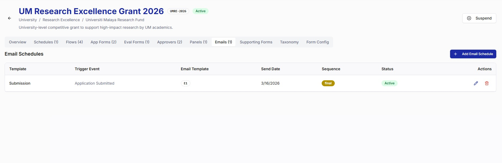
> *Screenshot: Email schedule configuration showing event triggers (Application Submitted, Revision Requested, Panel Assigned, etc.) with linked email templates and recipient groups.*

**Purpose**: Configure which email notifications are sent at each workflow stage.

1. Select an **Event Trigger** (e.g., "Application Submitted")
2. Select the **Email Template** to use
3. Define **Recipients** (PI, Team Members, Admins, Panels)
4. Click **"Save"**

---

#### Tab 6: Schedules/Phases

> ![Screenshot Placeholder: Schedules/Phases Tab]
> *Screenshot: Grant schedule configuration with start/end dates, disbursement phases, and vote category allocation per phase. Example: Phase 1 (Jan-Jun 2026) with Vote 11000: RM50,000, Vote 21000: RM30,000.*

**Purpose**: Define the grant disbursement timeline and budget allocation per vote code.

---

#### Tab 7: Thrust Areas & SDGs

> ![Screenshot Placeholder: Thrust Areas & SDGs Tab]
> *Screenshot: Checkbox grids for selecting applicable Thrust Areas and SDGs for this grant funding. Shows which thrust areas and SDGs are selected (checked) vs. available.*

**Purpose**: Link this grant to relevant research thrust areas and Sustainable Development Goals.

---

### 6.6 Email Templates

> 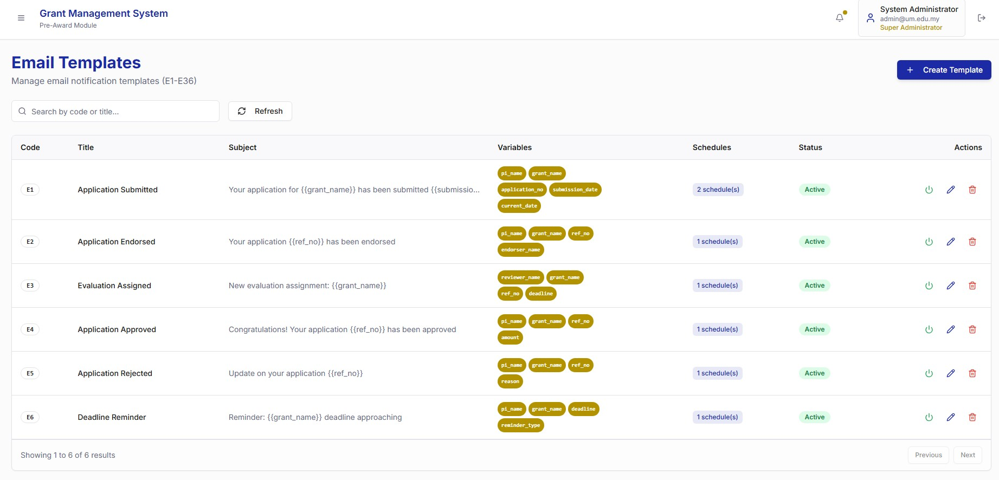
> *Screenshot: Email templates list showing 36+ templates with columns: Template Code (E1-E36), Template Name, Event Trigger, Status, Actions. "Create Template" button. Preview panel showing rendered email with UM branding.*

**Purpose**: Manage the 36+ email notification templates used throughout the system.

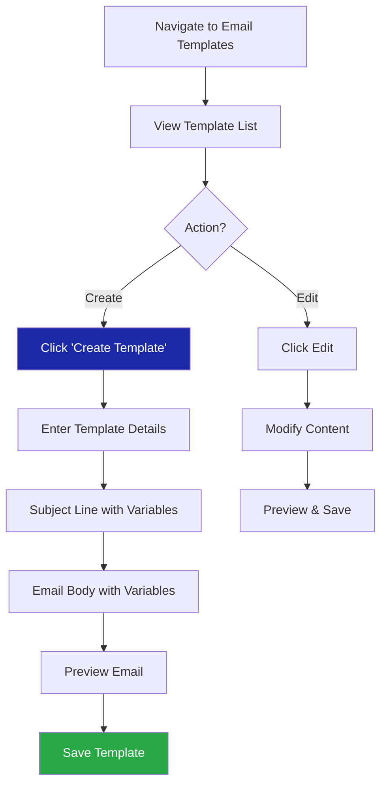
```mermaid
flowchart TD
    A[Navigate to Email Templates] --> B[View Template List]
    B --> C{Action?}
    C -->|Create| D[Click 'Create Template']
    D --> E[Enter Template Details]
    E --> F[Subject Line with Variables]
    F --> G[Email Body with Variables]
    G --> H[Preview Email]
    H --> I[Save Template]
    C -->|Edit| J[Click Edit]
    J --> K[Modify Content]
    K --> L[Preview & Save]

    style D fill:#1C29A7,color:#fff
    style I fill:#28a745,color:#fff
```

#### Example Available Template Variables

| Variable | Description | Example |
|----------|-------------|---------|
| `{{piName}}` | Principal Investigator name | "Dr. Ahmad bin Hassan" |
| `{{grantName}}` | Grant funding name | "UMRG Research Grant 2026" |
| `{{grantCode}}` | Grant code | "UMRG-2026" |
| `{{appNo}}` | Application number | "APP-2026-0001" |
| `{{callTitle}}` | Grant call title | "Call for UMRG Applications 2026/27" |
| `{{piEmail}}` | PI email address | "ahmad@um.edu.my" |
| `{{deadline}}` | Application deadline | "31 March 2026" |
| `{{link}}` | Action link URL | "https://gms.um.edu.my/..." |

---

### 6.7 Allocation Votes

> 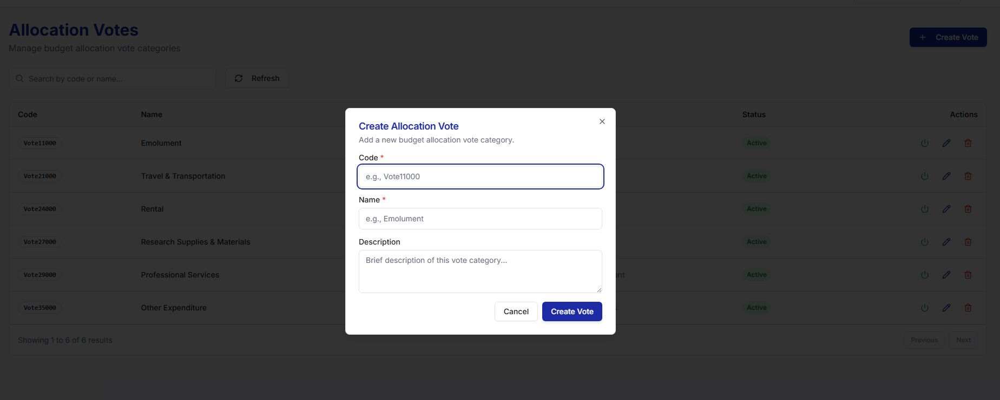
> *Screenshot: Allocation votes list showing vote codes: Vote 11000 (Wages & Salaries), Vote 21000 (Travel & Transportation), Vote 27000 (Research Supplies), Vote 29000 (Professional Services), Vote 35000 (Equipment). Each with description and status.*

**Purpose**: Configure budget vote categories used for grant financial tracking.

| Vote Code | Category |
|-----------|----------|
| Vote 11000 | Wages & Salaries |
| Vote 21000 | Travel & Transportation |
| Vote 27000 | Research Supplies & Materials |
| Vote 29000 | Professional Services |
| Vote 35000 | Equipment & Assets |

---

### 6.8 Approver Registry

> 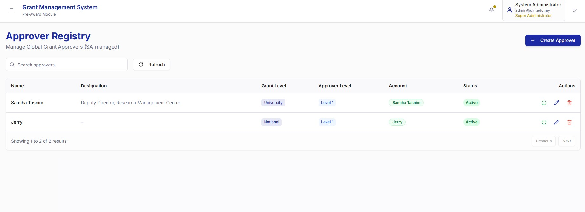
> *Screenshot: Approver registry showing registered approvers with columns: Name, Designation (HOD, Dean, DVC, VC), RMC, Level, Account Status (Active, Invited, No Account), Actions (Edit, Link Account, Remove).*

**Purpose**: Register and manage approvers who will be available for grant approval chains.

1. Navigate to **Grant Setup → Approver Registry**
2. Click **"Add Approver"**
3. Enter **Name**, **Designation**, **RMC**, and **Approval Level**
4. Optionally link to an existing user account or send an invitation

---

## 7. Module M03 — Announcements & Grant Calls

### 7.1 Overview

Module M03 handles the creation of grant calls and the broadcasting of announcements to researchers through multiple channels (email, website, UMmail, WhatsApp).

> **Access**: Administrator and Staff roles

### 7.2 Grant Call Lifecycle

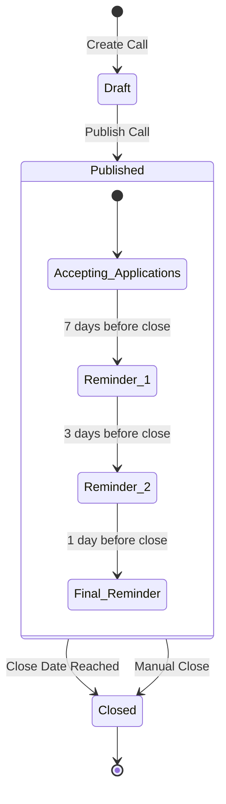
```mermaid
stateDiagram-v2
    [*] --> Draft: Create Call
    Draft --> Published: Publish Call
    Published --> Closed: Close Date Reached
    Published --> Closed: Manual Close
    Closed --> [*]

    state Published {
        [*] --> Accepting_Applications
        Accepting_Applications --> Reminder_1: 7 days before close
        Reminder_1 --> Reminder_2: 3 days before close
        Reminder_2 --> Final_Reminder: 1 day before close
    }
```

### 7.3 Creating a Grant Call

> ![Screenshot Placeholder: Create Grant Call Page]
> *Screenshot: Full-page form with sections: Grant Selection (dropdown), Call Details (Title, Description, Eligibility), Dates (Open Date, Close Date, Funder Deadline), Financial (Max Funding Amount), Contact (URL, Email), Documents (Required documents list), Reminders (3 reminder date pickers).*

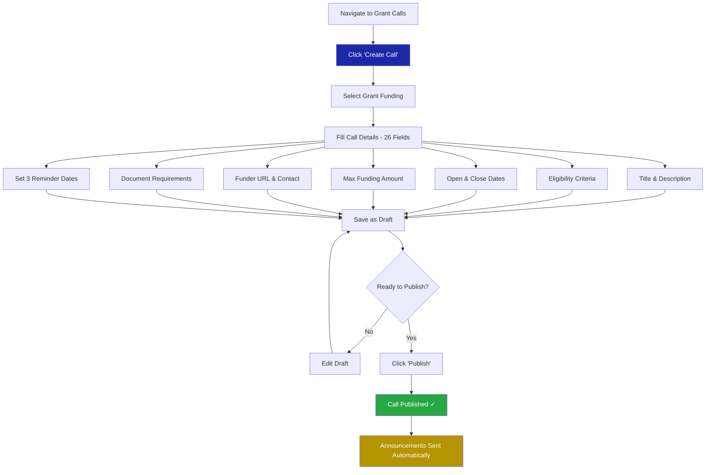
```mermaid
flowchart TD
    A[Navigate to Grant Calls] --> B[Click 'Create Call']
    B --> C[Select Grant Funding]
    C --> D[Fill Call Details - 26 Fields]
    D --> D1[Title & Description]
    D --> D2[Eligibility Criteria]
    D --> D3[Open & Close Dates]
    D --> D4[Max Funding Amount]
    D --> D5[Funder URL & Contact]
    D --> D6[Document Requirements]
    D --> D7[Set 3 Reminder Dates]
    D1 & D2 & D3 & D4 & D5 & D6 & D7 --> E[Save as Draft]
    E --> F{Ready to Publish?}
    F -->|No| G[Edit Draft]
    G --> E
    F -->|Yes| H[Click 'Publish']
    H --> I[Call Published ✓]
    I --> J[Announcements Sent Automatically]

    style B fill:#1C29A7,color:#fff
    style I fill:#28a745,color:#fff
    style J fill:#B49400,color:#fff
```

#### Step-by-Step: Create a Call

1. Navigate to **Announcements → Grant Calls**
2. Click **"Create Call"**
3. **Select Grant Funding** — Choose the pre-configured grant program from M02
4. Fill in the **26 call fields**:
   - **Title** — Call title (e.g., "Call for UMRG Applications 2026/27")
   - **Description** — Detailed call description
   - **Eligibility** — Who can apply
   - **Open Date** — When applications start accepting
   - **Close Date** — Application deadline
   - **Funder Deadline** — Funder's own deadline (if external)
   - **Max Funding** — Maximum grant amount per application
   - **Contact Details** — Funder URL, email, phone
   - **Document Requirements** — List of required documents
   - **Niche Area** — Specific research focus
   - **Reminder Dates** — 3 reminder dates before deadline
5. Click **"Save as Draft"**

### 7.4 Publishing a Call

1. Review the draft call details
2. Click **"Publish"**
3. The call status changes to **Published**
4. Announcements are automatically triggered

### 7.5 Grant Call Dashboard

> ![Screenshot Placeholder: Grant Calls Dashboard]
> *Screenshot: Dashboard cards showing: Total Calls (25), Open Calls (8), Closed Calls (15), Active Milestones (12). Below: list of calls with status badges, application counts, and action buttons.*

The dashboard provides summary cards:
- **Total Calls** — All calls in the system
- **Open Calls** — Currently accepting applications
- **Closed Calls** — Past deadline
- **Milestones** — Active workflow milestones

### 7.6 Announcements

> ![Screenshot Placeholder: Announcement Creation]
> *Screenshot: Announcement creation form showing: Title, Content (rich text editor), Platforms (checkboxes: Website, UMmail, UMportal, WhatsApp), Recipient Group (All, UM Internal, UM External), Attachments (file upload), Preview panel.*

Announcements can be broadcast through:
- **Email** — Direct email to eligible researchers
- **Website** — Published on the GMS portal
- **UMmail** — UM internal mail system
- **UMportal** — UM intranet
- **WhatsApp** — Business API (when configured)

---

## 8. Module M04 — Proposal Preparation

### 8.1 Overview

Module M04 allows Principal Investigators (PIs) to prepare research proposals before formal grant application. This module is **optional** — PIs may go directly to M05 (Grant Application) instead.

> **Access**: PI/Researcher (own proposals), Administrator (all proposals)
> **Note**: This module may be skipped as researchers often go directly to grant applications.

### 8.2 Proposal Lifecycle

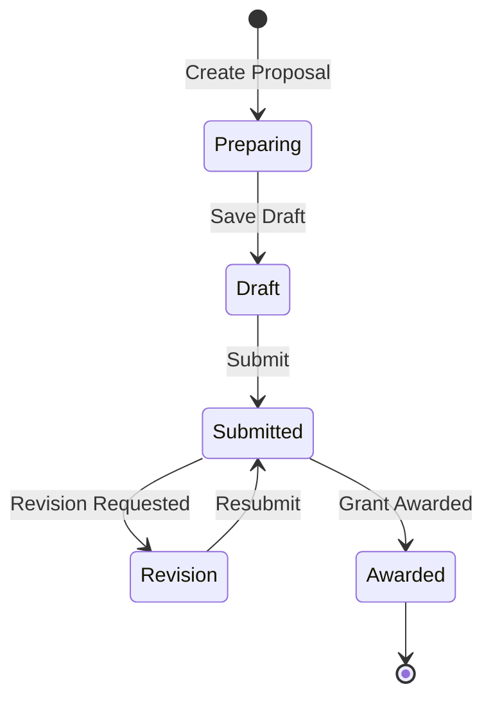
```mermaid
stateDiagram-v2
    [*] --> Preparing: Create Proposal
    Preparing --> Draft: Save Draft
    Draft --> Submitted: Submit
    Submitted --> Revision: Revision Requested
    Revision --> Submitted: Resubmit
    Submitted --> Awarded: Grant Awarded
    Awarded --> [*]
```

### 8.3 PI Workflow — My Proposals

> ![Screenshot Placeholder: My Proposals Page]
> *Screenshot: PI's proposal list showing cards/table with columns: Title, Status (badge), Application Type (Internal/External), Created Date, Last Modified, Actions (Edit, View, Delete, Download PDF). Dashboard cards: Preparing (3), Draft (5), Submitted (2), Revision (1), Awarded (1).*

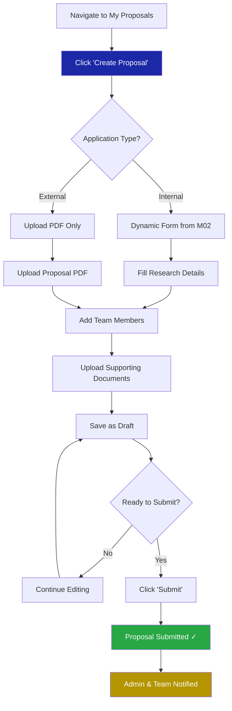
```mermaid
flowchart TD
    A[Navigate to My Proposals] --> B[Click 'Create Proposal']
    B --> C{Application Type?}
    C -->|Internal| D[Dynamic Form from M02]
    C -->|External| E[Upload PDF Only]
    D --> F[Fill Research Details]
    E --> G[Upload Proposal PDF]
    F --> H[Add Team Members]
    G --> H
    H --> I[Upload Supporting Documents]
    I --> J[Save as Draft]
    J --> K{Ready to Submit?}
    K -->|No| L[Continue Editing]
    L --> J
    K -->|Yes| M[Click 'Submit']
    M --> N[Proposal Submitted ✓]
    N --> O[Admin & Team Notified]

    style B fill:#1C29A7,color:#fff
    style N fill:#28a745,color:#fff
    style O fill:#B49400,color:#fff
```

#### How to Create a Proposal

> ![Screenshot Placeholder: Create Proposal — Type Selection]
> *Screenshot: Dialog showing two cards: "Internal Grant" (with dynamic form icon and description) and "External Grant" (with PDF upload icon and description). Call selection dropdown above.*

1. Navigate to **My Proposals**
2. Click **"Create Proposal"**
3. Select the **Application Type**:
   - **Internal** — Fill out the dynamic application form (configured in M02)
   - **External** — Upload a PDF proposal document
4. Select the **Grant Call** (if applicable)
5. Enter proposal details and save

#### How to Add Team Members

> ![Screenshot Placeholder: Team Members Tab]
> *Screenshot: Team member table with columns: Name, Faculty/Department, Designation, Email, UMExpert Link, Editing Access (toggle), Actions (Remove). "Add Member" button.*

1. Open your proposal
2. Navigate to the **Team Members** section
3. Click **"Add Member"**
4. Enter: Name, Faculty, Designation, Email, UMExpert Link
5. Optionally grant **Editing Access** to allow co-editing

#### How to Submit a Proposal

1. Ensure all required fields are filled
2. Click **"Submit"**
3. The proposal is locked (read-only)
4. All team members receive a notification email

### 8.4 Admin View — Master Proposal List

> ![Screenshot Placeholder: Admin Proposals Master List]
> *Screenshot: Master list table with filters (Status, Search), columns: Title, PI Name, PI Email, Department, Status, Version, Created Date, Actions (View, Change Status, Export). Summary stats cards at top.*

Administrators can:
- View **all proposals** across all PIs
- **Change status** (e.g., Request Revision, Award)
- **Export** proposals to CSV
- **Download** proposal PDFs

---

## 9. Module M05 — Grant Application

### 9.1 Overview

Module M05 is the **core pre-award module** where PIs submit grant applications, admins conduct technical checks, assign panels, and manage the application lifecycle.

> **Access**: PI (own applications), Administrator (all applications), Panel Members (assigned evaluations)

### 9.2 Application Lifecycle

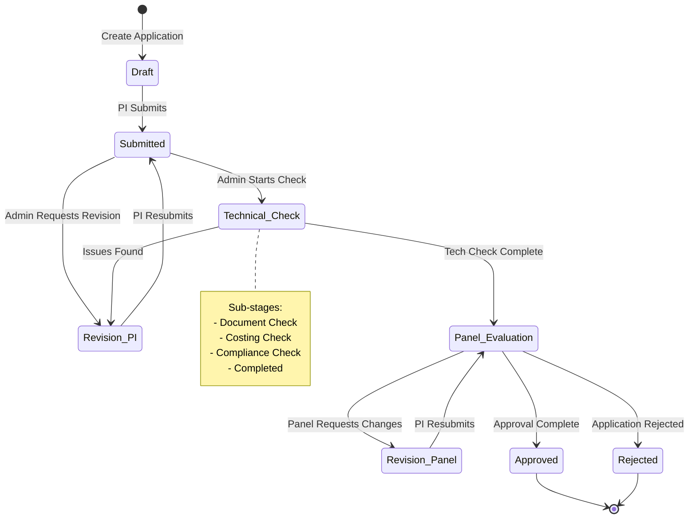
```mermaid
stateDiagram-v2
    [*] --> Draft: Create Application
    Draft --> Submitted: PI Submits
    Submitted --> Revision_PI: Admin Requests Revision
    Revision_PI --> Submitted: PI Resubmits
    Submitted --> Technical_Check: Admin Starts Check
    Technical_Check --> Panel_Evaluation: Tech Check Complete
    Technical_Check --> Revision_PI: Issues Found
    Panel_Evaluation --> Revision_Panel: Panel Requests Changes
    Revision_Panel --> Panel_Evaluation: PI Resubmits
    Panel_Evaluation --> Approved: Approval Complete
    Panel_Evaluation --> Rejected: Application Rejected
    Approved --> [*]
    Rejected --> [*]

    note right of Technical_Check
        Sub-stages:
        - Document Check
        - Costing Check
        - Compliance Check
        - Completed
    end note
```

### 9.3 PI Workflow — My Applications

> ![Screenshot Placeholder: My Applications Dashboard]
> *Screenshot: PI's application dashboard with status summary cards (Draft: 3, Submitted: 5, Under Review: 2, Approved: 1, Rejected: 0, Withdrawn: 0). Application list table below with columns: App No, Project Title, Grant, Status, Submitted Date, Actions.*

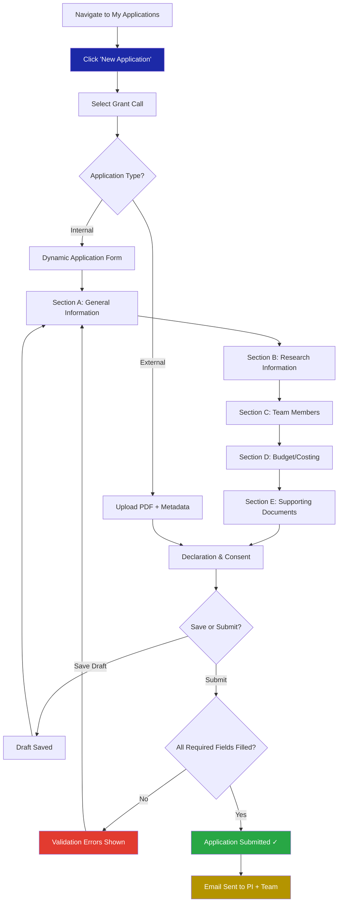
```mermaid
flowchart TD
    A[Navigate to My Applications] --> B[Click 'New Application']
    B --> C[Select Grant Call]
    C --> D{Application Type?}
    D -->|Internal| E[Dynamic Application Form]
    D -->|External| F[Upload PDF + Metadata]

    E --> G[Section A: General Information]
    G --> H[Section B: Research Information]
    H --> I[Section C: Team Members]
    I --> J[Section D: Budget/Costing]
    J --> K[Section E: Supporting Documents]
    K --> L[Declaration & Consent]

    F --> L

    L --> M{Save or Submit?}
    M -->|Save Draft| N[Draft Saved]
    N --> G
    M -->|Submit| O{All Required Fields Filled?}
    O -->|No| P[Validation Errors Shown]
    P --> G
    O -->|Yes| Q[Application Submitted ✓]
    Q --> R[Email Sent to PI + Team]

    style B fill:#1C29A7,color:#fff
    style Q fill:#28a745,color:#fff
    style R fill:#B49400,color:#fff
    style P fill:#E23B30,color:#fff
```

#### Step-by-Step: Create an Application

**Step 1 — Start a New Application**

> ![Screenshot Placeholder: New Application — Call Selection]
> *Screenshot: Dialog showing list of open grant calls with: Call Title, Grant Name, Deadline, Max Funding, "Select" button for each.*

1. Navigate to **Grant Application → My Applications**
2. Click **"New Application"** (or use "Apply Now" from the Dashboard)
3. Select the **Grant Call** you want to apply for
4. Choose **Application Type** (Internal or External)

**Step 2 — Fill Section A: General Information**

> ![Screenshot Placeholder: Application Form — Section A]
> *Screenshot: Form section showing fields: Project Title (text), Keywords (textarea), Project Duration (number), Start Date (date picker), Abstract (textarea). Red asterisks on required fields.*

1. Enter the **Project Title**
2. Fill in **Keywords**, **Duration**, **Start Date**
3. Write the **Research Abstract**
4. Fields marked with a red asterisk (*) are **required**

**Step 3 — Fill Section B: Research Information**

> ![Screenshot Placeholder: Application Form — Section B]
> *Screenshot: Form section showing: Research Domain (dropdown), Thrust Areas (checkbox list), SDG Goals (checkbox list), TRL Level From/To (number inputs), Keywords (tags input).*

1. Select your **Research Domain** and sub-domain
2. Check applicable **Thrust Areas**
3. Check applicable **SDG Goals**
4. Enter **TRL Level** range (Technology Readiness Level)

**Step 4 — Fill Section C: Team Members**

> ![Screenshot Placeholder: Application Form — Team Members]
> *Screenshot: Team member table with "Add Member" button. Each row: Name, Faculty/Department, Designation, Email, UMExpert Link, Role (Co-Researcher Internal/External, Collaborator, Consultant), "Next Leader" checkbox. Remove button per row.*

1. Click **"Add Team Member"**
2. For each member, enter:
   - **Name** — Full name
   - **Faculty/Department** — Their affiliated unit
   - **Designation** — Academic title/position
   - **Email** — Contact email
   - **UMExpert Link** — Link to their UMExpert profile
   - **Role** — Co-Researcher (Internal/External), Collaborator, or Consultant
   - **"Next Appointed Leader"** — Check if this person is designated as the next project leader

**Step 5 — Fill Section D: Budget/Costing**

> ![Screenshot Placeholder: Application Form — Budget]
> *Screenshot: Budget table with columns: Vote Code (dropdown: Vote 11000, 21000, 27000, 29000, 35000), Year 1 Amount, Year 2 Amount, Year 3 Amount, Justification (textarea). "Add Budget Item" button. Total row at bottom.*

1. Click **"Add Budget Item"**
2. Select the **Vote Code** (loaded dynamically from M02)
3. Enter the **Amount** for each year
4. Provide **Justification** for the expense
5. Review the **Total Budget** at the bottom

**Step 6 — Upload Supporting Documents**

> ![Screenshot Placeholder: Application Form — Documents]
> *Screenshot: Document upload area with drag-and-drop zone. Uploaded files list showing: File Name, Size, Type, Upload Date, Actions (Download, Delete). Supported formats: PDF, PNG, JPEG (max 15MB).*

1. Click **"Upload Document"** or drag-and-drop files
2. Supported formats: PDF, PNG, JPEG
3. Maximum file size: **15MB per file**
4. All uploaded files appear in the documents list

**Step 7 — Submit Application**

> ![Screenshot Placeholder: Submit Confirmation]
> *Screenshot: Submit confirmation dialog showing: "Are you sure you want to submit this application? Once submitted, the form will be locked for editing until a revision is requested." with Cancel and Submit buttons.*

1. Click **"Submit Application"**
2. The system validates all **required fields**
   - If any required fields are missing, red error borders appear
   - The page scrolls to the first error
3. If validation passes, confirm submission
4. The application status changes to **"Submitted"**
5. Notification emails are sent to:
   - **PI** — Submission confirmation
   - **All Team Members** — Notification of inclusion
6. The form is **locked** (read-only) until a revision is requested

---

### 9.4 Admin Workflow — Application Management

> ![Screenshot Placeholder: Admin Applications Master List]
> *Screenshot: Admin applications page with dashboard cards (Draft, Submitted, Technical Check, Panel Evaluation, Approved, Rejected, Withdrawn counts). Filter bar (Status, Grant, Search). Table with columns: App No, PI Name, Department, Call, Status, Tech Check Status, Submitted Date, Actions.*

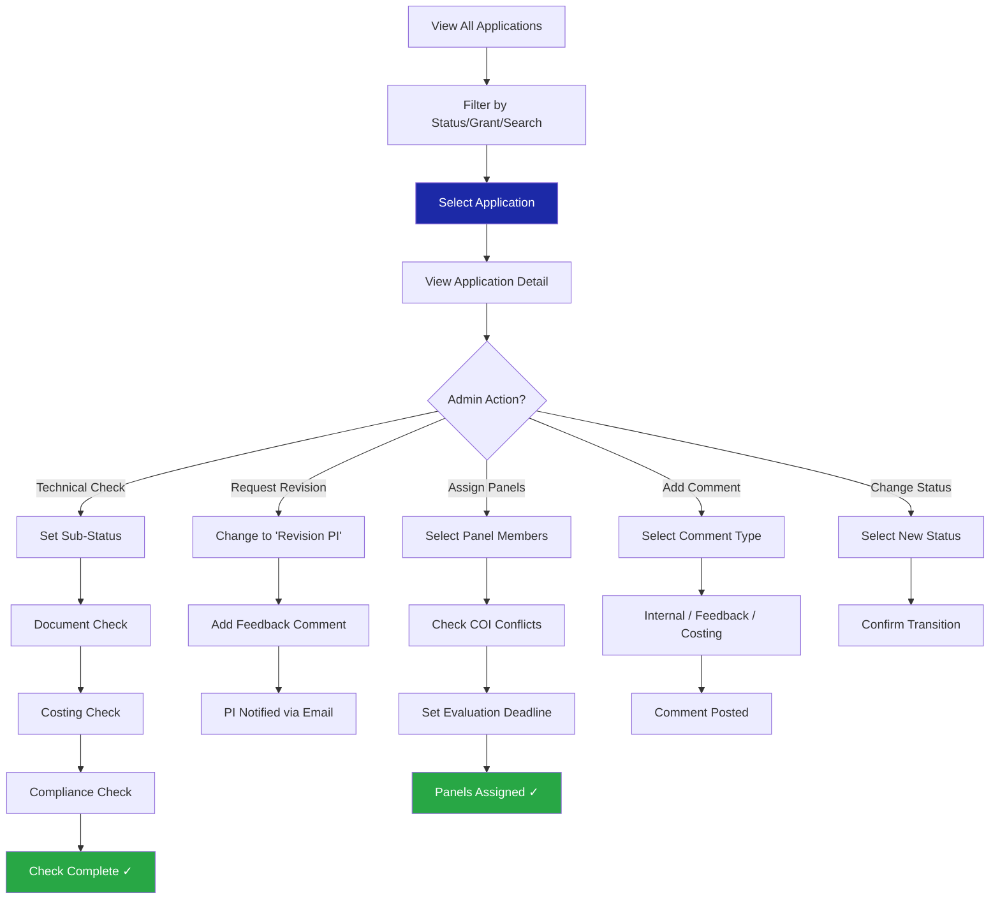
```mermaid
flowchart TD
    A[View All Applications] --> B[Filter by Status/Grant/Search]
    B --> C[Select Application]
    C --> D[View Application Detail]
    D --> E{Admin Action?}

    E -->|Technical Check| F[Set Sub-Status]
    F --> F1[Document Check]
    F1 --> F2[Costing Check]
    F2 --> F3[Compliance Check]
    F3 --> F4[Check Complete ✓]

    E -->|Request Revision| G[Change to 'Revision PI']
    G --> G1[Add Feedback Comment]
    G1 --> G2[PI Notified via Email]

    E -->|Assign Panels| H[Select Panel Members]
    H --> H1[Check COI Conflicts]
    H1 --> H2[Set Evaluation Deadline]
    H2 --> H3[Panels Assigned ✓]

    E -->|Add Comment| I[Select Comment Type]
    I --> I1[Internal / Feedback / Costing]
    I1 --> I2[Comment Posted]

    E -->|Change Status| J[Select New Status]
    J --> J1[Confirm Transition]

    style C fill:#1C29A7,color:#fff
    style F4 fill:#28a745,color:#fff
    style H3 fill:#28a745,color:#fff
```

#### Technical Check Process

> ![Screenshot Placeholder: Technical Check Interface]
> *Screenshot: Application detail page showing Technical Check panel with sub-status dropdown (Document Check, Costing Check, Compliance Check, Completed), current sub-status badge, and comments section.*

1. Open the submitted application
2. Set **Technical Check Sub-Status**:
   - **Document Check** — Verify all required documents are uploaded
   - **Costing Check** — Verify budget justifications
   - **Compliance Check** — Verify eligibility and compliance
   - **Completed** — All checks passed
3. Add **Internal Comments** for admin notes
4. Add **Feedback Comments** if revision is needed (sent to PI)
5. Once complete, change status to **"Panel Evaluation"**

#### Panel Assignment

> ![Screenshot Placeholder: Panel Assignment Dialog]
> *Screenshot: Panel assignment modal showing: Search panelists input, available panelists list with checkboxes (Name, Department, Expertise), COI indicator (green check = no conflict, red X = conflict), Evaluation Deadline date picker, Blind Review toggle, "Assign" button.*

1. Click **"Assign Panels"**
2. Search for panel members by name or department
3. The system checks for **Conflict of Interest (COI)**:
   - Cannot be the PI
   - Cannot be a team member
   - Cannot be from the same batch
4. Select panel members (checkbox)
5. Set the **Evaluation Deadline**
6. Optionally enable **Blind Review** (anonymize PI details)
7. Click **"Assign"**

#### Comments System

> ![Screenshot Placeholder: Comments Panel]
> *Screenshot: Comments section showing threaded comments with type badges (Internal in blue, Feedback in orange, Costing in green), author name, timestamp, and comment text.*

Three types of comments:
- **Internal** — Admin-to-admin notes (not visible to PI)
- **Feedback** — Admin-to-PI feedback (PI can see)
- **Costing** — Finance-focused comments

---

## 10. Module M06 — Proposal Evaluation

### 10.1 Overview

Module M06 manages the evaluation process where assigned panel members independently review and score grant applications using configurable evaluation forms.

> **Access**: Panel Members (assigned evaluations), Administrator (all evaluations)

### 10.2 Evaluation Workflow

```mermaid
flowchart TD
    subgraph "Admin Actions"
        A1[Assign Panel Members] --> A2[Set Deadline]
        A2 --> A3[Monitor Progress]
        A3 --> A4{All Evaluations Complete?}
        A4 -->|No| A5[Send Reminders]
        A5 --> A3
        A4 -->|Yes| A6[Generate Summary & Rankings]
        A6 --> A7[Export Reports]
    end

    subgraph "Panel Member Workflow"
        P1[Receive Assignment Email] --> P2[Login to My Evaluations]
        P2 --> P3[Step 1: Sign NDA & COI]
        P3 --> P4[Step 2: Review Application]
        P4 --> P5[Step 3: Fill Evaluation Form]
        P5 --> P6[Score Each Criterion]
        P6 --> P7[Add Section Comments]
        P7 --> P8[Overall Recommendation]
        P8 --> P9[Submit Evaluation ✓]
    end

    A1 -.-> P1
    P9 -.-> A3

    style A1 fill:#1C29A7,color:#fff
    style A6 fill:#28a745,color:#fff
    style P9 fill:#28a745,color:#fff
```

### 10.3 Panel Member Workflow

#### Step 1: Sign NDA & Conflict of Interest Declaration

> ![Screenshot Placeholder: NDA & COI Step]
> *Screenshot: Page showing NDA text with agreement checkbox, COI declaration form with Yes/No options and details textarea if Yes, "Proceed" button.*

1. Navigate to **Evaluation → My Evaluations**
2. Find your assignment and click **"Start Evaluation"**
3. Read and sign the **Non-Disclosure Agreement (NDA)**
4. Complete the **Conflict of Interest (COI)** declaration:
   - Declare if you have any conflicts with the applicant
   - If YES, provide details (the assignment may be reassigned)
   - If NO, proceed to application review
5. Click **"Proceed"**

#### Step 2: Review Application (Read-Only)

> ![Screenshot Placeholder: Application Review — Read-Only]
> *Screenshot: Read-only view of the full application showing all sections (General Info, Research Info, Team, Budget, Documents) in a clean, printable format. Blind review mode shows "[REDACTED]" for PI name.*

1. Review the complete application form
2. All sections are displayed in **read-only** format
3. If **Blind Review** is enabled, the PI's name is replaced with "[REDACTED]"
4. Download supporting documents as needed
5. Click **"Proceed to Evaluation"**

#### Step 3: Fill Evaluation Form

> ![Screenshot Placeholder: Evaluation Scoring Form]
> *Screenshot: Evaluation form with sections. Each section shows: Section Name, Weight %, criteria list with score sliders (0-Max), section comment textarea. Overall Assessment section at bottom with recommendation dropdown (Recommended/Not Recommended) and overall comment.*

1. For each **Section** in the evaluation form:
   - Score each **Criterion** using the slider (0 to Max Score)
   - Write **Section Comments** explaining your scores
2. The **Section Percentage** is calculated automatically
3. The **Weighted Score** is displayed in real-time
4. Complete the **Overall Assessment**:
   - Select **Recommendation**: Recommended / Not Recommended
   - Write **Overall Comments**
5. Click **"Submit Evaluation"**

> **Important**: Once submitted, your evaluation is locked. Contact the administrator if changes are needed.

### 10.4 Admin Evaluation Management

> ![Screenshot Placeholder: Admin Evaluation Dashboard]
> *Screenshot: Evaluation management page showing: Stats cards (Total in Evaluation, All Panels Done, In Progress, No Panels Assigned). Application list with evaluation progress indicators (colored dots: green=completed, blue=in progress, red=declined, grey=pending). Actions: Generate Rankings, Auto Reminders, Export CSV.*

```mermaid
flowchart TD
    A[Navigate to Evaluations] --> B[View Applications in Evaluation]
    B --> C[Monitor Panel Progress]
    C --> D{Action?}
    D -->|View Detail| E[Open Application Evaluation Detail]
    E --> E1[Tab: Panel Assignments]
    E --> E2[Tab: Evaluation Results]
    E --> E3[Tab: Summary & Ranking]
    D -->|Send Reminders| F[Select Overdue Panels]
    F --> F1[Choose: Gentle 1 / Gentle 2 / Final]
    F1 --> F2[Reminders Sent]
    D -->|Generate Summary| G[Calculate Scores]
    G --> G1[Average Weighted Scores]
    G1 --> G2[Assign Rankings]
    G2 --> G3[Summary Generated ✓]
    D -->|Export| H[Export CSV / PDF Report]

    style A fill:#1C29A7,color:#fff
    style G3 fill:#28a745,color:#fff
```

#### Evaluation Detail Page

> ![Screenshot Placeholder: Evaluation Detail — Panel Assignments Tab]
> *Screenshot: Tabbed detail page. Panel Assignments tab showing: Panel member list with Status (Pending/NDA Pending/Accepted/In Progress/Completed/Declined), Deadline, NDA signed date, COI status, Score (if completed), Actions (Send Reminder, View Evaluation, Remove).*

> ![Screenshot Placeholder: Evaluation Detail — Summary Tab]
> *Screenshot: Summary tab showing: Overall rank, Average weighted score, Panel completion count, Individual panel scores in a comparison table, Recommendation summary (X Recommended / Y Not Recommended).*

#### Panel Assignment Statuses

```mermaid
stateDiagram-v2
    [*] --> Pending: Assigned
    Pending --> NDA_Pending: Panel Logs In
    NDA_Pending --> Accepted: NDA & COI Signed
    NDA_Pending --> Declined: Panel Declines
    Accepted --> In_Progress: Started Evaluation
    In_Progress --> Completed: Submitted
    Completed --> [*]
    Declined --> [*]
```

---

## 11. Module M07 — Grant Approval

### 11.1 Overview

Module M07 manages the multi-level approval process where designated approvers review and approve/reject applications, followed by offer letter generation and PI response management.

> **Access**: Approvers (assigned applications), PI (own offers), Administrator (all approvals)

### 11.2 Approval Lifecycle

```mermaid
stateDiagram-v2
    [*] --> Approval_Pending: Evaluation Complete
    Approval_Pending --> Level_1_Review: L1 Approver Reviews

    state Level_1_Review {
        [*] --> L1_Pending
        L1_Pending --> L1_Approved: Approve
        L1_Pending --> L1_Rejected: Reject
    }

    Level_1_Review --> Level_2_Review: L1 Approved
    Level_1_Review --> Rejected: L1 Rejected

    state Level_2_Review {
        [*] --> L2_Pending
        L2_Pending --> L2_Approved: Approve
        L2_Pending --> L2_Rejected: Reject
    }

    Level_2_Review --> Level_3_Review: L2 Approved
    Level_2_Review --> Rejected: L2 Rejected

    state Level_3_Review {
        [*] --> L3_Pending
        L3_Pending --> L3_Approved: Approve
        L3_Pending --> L3_Rejected: Reject
    }

    Level_3_Review --> All_Approved: L3 Approved
    Level_3_Review --> Rejected: L3 Rejected

    All_Approved --> Offer_Letter: Generate Offer
    Offer_Letter --> Offer_Sent: Send to PI
    Offer_Sent --> Offer_Accepted: PI Accepts
    Offer_Sent --> Offer_Negotiated: PI Negotiates
    Offer_Sent --> Offer_Rejected: PI Rejects
    Offer_Negotiated --> Offer_Letter: Revised Offer
    Offer_Accepted --> Account_Created: M08
    Offer_Rejected --> [*]
    Rejected --> [*]
    Account_Created --> [*]
```

### 11.3 Approver Workflow

> ![Screenshot Placeholder: My Approvals Dashboard]
> *Screenshot: Approver's dashboard with two tabs: Pending and History. Pending tab shows applications awaiting decision with columns: App No, Project Title, PI, Grant, Level, Working Days Remaining (color-coded: green/yellow/red), Actions (Review). History tab shows past decisions.*

```mermaid
flowchart TD
    A[Receive Approval Assignment Email] --> B[Login → My Approvals]
    B --> C[View Pending Applications]
    C --> D[Click 'Review' on Application]
    D --> E[Review Application Summary]
    E --> F[Review Budget Breakdown]
    F --> G[View Approval Chain Status]
    G --> H{Decision?}
    H -->|Approve| I[Enter Approval Comments]
    I --> J[Click 'Approve' ✓]
    H -->|Reject| K[Enter Rejection Reason]
    K --> L[Click 'Reject' ✗]

    J --> M{All Levels Approved?}
    M -->|Yes| N[Application → Offer Letter Stage]
    M -->|No| O[Next Level Notified]

    L --> P[Application Rejected]

    style D fill:#1C29A7,color:#fff
    style J fill:#28a745,color:#fff
    style L fill:#E23B30,color:#fff
    style N fill:#28a745,color:#fff
```

#### Step-by-Step: Review and Approve

> ![Screenshot Placeholder: Approval Decision Page]
> *Screenshot: Approval review page showing: Application summary (title, PI, grant, call), Budget breakdown table, Approval chain timeline (previous levels with their decisions), Decision section with Approve/Reject buttons and Comments textarea.*

1. Navigate to **Grant Approval → My Approvals**
2. Click **"Review"** on a pending application
3. Review the application summary and budget
4. View the **Approval Chain** to see previous approvers' decisions
5. Make your decision:
   - **Approve**: Enter comments and click **"Approve"**
   - **Reject**: Enter the reason for rejection and click **"Reject"**

> **Important**:
> - You have **5 working days** to make a decision
> - If you're Level 2, you can only act after Level 1 has approved
> - Rejection at ANY level rejects the entire application

---

### 11.4 Admin — Offer Letter Management

> ![Screenshot Placeholder: Offer Letter Generation]
> *Screenshot: Offer letter page showing: Template preview with UM branding, editable fields (Start Date, End Date, Budget Table, Milestones, Terms & Conditions), "Generate" and "Send to PI" buttons.*

```mermaid
flowchart TD
    A[All Approvers Approved] --> B[Admin Opens Approval Detail]
    B --> C[Navigate to 'Offer Letter' Tab]
    C --> D[Click 'Generate Offer Letter']
    D --> E[Review Generated Letter]
    E --> F{Need Changes?}
    F -->|Yes| G[Edit Offer Content]
    G --> E
    F -->|No| H[Click 'Send to PI']
    H --> I[PI Receives Email with Offer]
    I --> J{PI Response?}
    J -->|Accept| K[Status → Offer Accepted ✓]
    J -->|Negotiate| L[PI Sends Counter-Comments]
    J -->|Reject| M[Status → Offer Rejected ✗]
    L --> N[Admin Reviews Comments]
    N --> O[Create Revised Offer]
    O --> H
    K --> P[Proceed to M08: Grant Account]

    style D fill:#1C29A7,color:#fff
    style K fill:#28a745,color:#fff
    style M fill:#E23B30,color:#fff
    style P fill:#28a745,color:#fff
```

#### Step-by-Step: Generate and Send Offer Letter

1. Once all approvers have approved, open the application detail
2. Go to the **"Offer Letter"** tab
3. Click **"Generate Offer Letter"**
4. The system creates an offer with:
   - **Start/End Dates**
   - **Approved Budget Table** (per vote code and year)
   - **Milestones**
   - **Terms & Conditions**
5. Review and edit as needed
6. Click **"Send to PI"**
7. The PI receives an email with a link to view the offer

### 11.5 PI — Responding to Offer

> ![Screenshot Placeholder: PI Offer Response Page]
> *Screenshot: Offer letter view showing: Full offer letter with budget details, Start/End dates, Terms. Three response buttons: "Accept Offer" (green), "Negotiate" (yellow), "Reject Offer" (red). Comments textarea for negotiate/reject.*

1. PI receives an email with a link to the offer
2. PI reviews the **offer letter** with all terms
3. PI selects a response (within **5 working days**):
   - **Accept** — Proceeds to grant account creation (M08)
   - **Negotiate** — Sends counter-comments to admin; admin creates revised offer
   - **Reject** — Declines the offer with a reason

---

## 12. Module M08 — Grant Account Creation

### 12.1 Overview

Module M08 materializes accepted offers into formal grant accounts with project numbers, financial tracking, team management, milestones, and document storage.

> **Access**: Administrator (create/manage), PI (view/upload for own accounts)

### 12.2 Grant Account Lifecycle

```mermaid
stateDiagram-v2
    [*] --> Created: Offer Accepted → Create Account
    Created --> Active: Account Activated

    state Active {
        [*] --> New
        New --> Ongoing: Work Begins
        Ongoing --> Extended: Extension Approved
        Extended --> End: Project Ends
        Ongoing --> End: Project Ends
    }

    Active --> Suspended: Admin Suspends
    Suspended --> Active: Admin Reactivates
    Active --> Closed: Project Completed
    Closed --> [*]
```

### 12.3 Admin Workflow — Create Grant Account

> ![Screenshot Placeholder: Grant Accounts Dashboard]
> *Screenshot: Grant accounts page showing pending banner ("3 accounts pending from accepted offers"), filter bar (Search, Status, Project Status, Account Type), account list table with columns: Project No, Project Title, PI, Grant, Status, Project Status, Budget, Start Date, End Date, Actions.*

```mermaid
flowchart TD
    A[Offer Accepted by PI] --> B[Navigate to Grant Accounts]
    B --> C[Click 'Create Account' for Application]
    C --> D[Auto-Populated Form]
    D --> D1[Project Number Generated: UM-NAT-2026-0001]
    D --> D2[PI & Team Auto-Copied]
    D --> D3[Budget Auto-Populated]
    D --> D4[Milestones from Offer Letter]
    D1 & D2 & D3 & D4 --> E[Review & Adjust Details]
    E --> F[Click 'Create Account' ✓]
    F --> G[Account Active]
    G --> H[PI & Team Notified]

    style C fill:#1C29A7,color:#fff
    style F fill:#28a745,color:#fff
    style H fill:#B49400,color:#fff
```

#### Step-by-Step: Create Account from Accepted Offer

> ![Screenshot Placeholder: Create Grant Account Form]
> *Screenshot: Account creation form showing auto-populated fields: Project Number (auto-generated), Project Title, PI Name (auto), Grant Funding (auto), Start Date, End Date, Total Allocation, Currency, GL Account Code, Cost Center. Team members table (auto-copied). Milestones section.*

1. Navigate to **Grant Account → Account Management**
2. Click **"Create Account"** next to an accepted application
3. The form is **auto-populated** from the accepted offer:
   - **Project Number** — Auto-generated (e.g., `UM-NAT-2026-0001`)
   - **Project Title** — From application
   - **PI & Team** — Copied from application team members
   - **Budget** — From approved budget
   - **Milestones** — From offer letter
4. Review and adjust any details
5. Set **financial fields**: Total Allocation, Currency, GL Code, Cost Center
6. Click **"Create Account"**
7. Notifications sent to PI and team members

#### Project Number Format

| Level | Code | Example |
|-------|------|---------|
| University | INT | UM-INT-2026-0001 |
| National | NAT | UM-NAT-2026-0015 |
| Private | PVT | UM-PVT-2026-0003 |
| International | INTL | UM-INTL-2026-0002 |

---

### 12.4 Admin — Account Detail Page

> ![Screenshot Placeholder: Account Detail — Overview Tab]
> *Screenshot: 6-tab detail page. Overview tab showing: Project number, Status badge (Active/Suspended/Closed), Project Status badge (New/Ongoing/Extended/End), PI details, Grant details, Financial summary (Total Allocated, Total Awarded), Start/End dates, Classification flags.*

The account detail page has **6 tabs**:

| Tab | Contents |
|-----|----------|
| **Overview** | Project number, status, dates, financial summary |
| **Project Details** | Title, description, WBS number, funder project numbers |
| **Budget** | Allocation breakdown by vote code per year |
| **Milestones** | Progress milestones with due dates and status |
| **Team** | Team members and roles |
| **Documents** | Uploaded project documents |

#### Account Status Actions

> ![Screenshot Placeholder: Account Status Actions]
> *Screenshot: Account action buttons: "Suspend Account" (yellow), "Extend Project" (blue), "Close Account" (red). Each opens a confirmation dialog with reason textarea.*

| Action | Description | Reversible? |
|--------|-------------|:-----------:|
| **Suspend** | Temporarily halt account with reason | Yes |
| **Reactivate** | Resume suspended account | N/A |
| **Extend** | Extend end date | Yes |
| **Close** | Permanently close account | No |

---

### 12.5 PI Workflow — My Grant Accounts

> ![Screenshot Placeholder: PI Grant Accounts]
> *Screenshot: PI's grant accounts page showing cards for each account: Project Number, Title, Grant Name, Status badge, Project Status badge, Budget (Total Allocated), Timeline (Start → End), Progress bar. Actions: View, Upload Documents, Request Extension.*

```mermaid
flowchart TD
    A[Navigate to My Grant Accounts] --> B[View Account Cards]
    B --> C{Action?}
    C -->|View Details| D[Open Account Detail]
    D --> D1[6 Tabs: Overview, Details, Budget, Milestones, Team, Documents]
    C -->|Upload Document| E[Select Document Type]
    E --> F[Upload File - Max 15MB]
    F --> G[Document Uploaded ✓]
    C -->|Request Extension| H[Enter New End Date]
    H --> I[Provide Justification]
    I --> J[Submit Extension Request]
    J --> K[Admin Notified]

    style D fill:#1C29A7,color:#fff
    style G fill:#28a745,color:#fff
    style K fill:#B49400,color:#fff
```

#### PI Can:
- **View** all account details (overview, budget, milestones, team)
- **Upload documents** (PDF, PNG, JPEG, DOC, DOCX, XLS, XLSX — max 15MB)
- **Request extension** with justification (admin reviews)
- **Update research activities** and expected output

#### PI Cannot:
- Modify team members
- Change milestones
- Adjust budget allocations
- Change account status

---

## 13. Module M09 — Reports & Analytics

### 13.1 Overview

Module M09 provides a flexible reporting engine that generates reports across all system modules with customizable columns, filters, and export formats.

> **Access**: Administrator and Super Administrator only

### 13.2 Report Generation Flow

```mermaid
flowchart TD
    A[Navigate to Reports] --> B[Select Report Module]
    B --> C{Module?}
    C -->|Setup M01| D1[RMC, Roles, Users data]
    C -->|Grants M02| D2[Grant Funding data]
    C -->|Calls M03| D3[Call details & stats]
    C -->|Proposals M04| D4[Proposal list & status]
    C -->|Applications M05| D5[Application data]
    C -->|Evaluations M06| D6[Evaluation scores]
    C -->|Approvals M07| D7[Approval decisions]
    C -->|Accounts M08| D8[Grant account data]

    D1 & D2 & D3 & D4 & D5 & D6 & D7 & D8 --> E[Select Columns]
    E --> F[Apply Filters]
    F --> F1[Search Text]
    F --> F2[Status Filter]
    F --> F3[Date Range]
    F1 & F2 & F3 --> G[Configure Sorting]
    G --> H[Generate Report]
    H --> I{Action?}
    I -->|View| J[View Results in Table]
    I -->|Export CSV| K[Download CSV File]
    I -->|Export Excel| L[Download Excel File]
    I -->|Save Template| M[Save Config for Reuse]
    I -->|Print| N[Print Report]

    style A fill:#1C29A7,color:#fff
    style H fill:#28a745,color:#fff
```

### 13.3 Report Configuration

> ![Screenshot Placeholder: Reports Page]
> *Screenshot: Reports page showing: Module selector tabs (Setup, Grants, Calls, Proposals, Applications, Evaluations, Approvals, Accounts), Column selection checkboxes, Filter panel (Search, Status dropdown, Date From/To), Sort options, "Generate Report" button, "Save Template" button, Export buttons (CSV, Excel).*

#### Step-by-Step: Generate a Report

1. Navigate to **Reports**
2. **Select Module** — Choose which data to report on (e.g., "Applications M05")
3. **Select Columns** — Check the columns you want:
   - Applications example: App No, PI Name, Email, Department, Call, Grant, Status, Submitted Date
4. **Apply Filters**:
   - **Search** — Free text search
   - **Status** — Filter by status (e.g., Approved only)
   - **Date Range** — From date to date
5. **Configure Sorting** — Sort by column, ascending/descending
6. Click **"Generate Report"**
7. View results in the table
8. **Export** — Click CSV or Excel to download
9. **Save Template** — Save your configuration for future reuse

### 13.4 Available Report Columns by Module

| Module | Available Columns |
|--------|------------------|
| **Setup (M01)** | Entity Type, Name, Description, Active, Related Count, Created At |
| **Grants (M02)** | Name, Code, Level, Type, Fund Source, Suspended, Applications Count, Calls Count, Created At |
| **Calls (M03)** | Title, Grant, Status, Open Date, Close Date, Applications Count, Created At |
| **Proposals (M04)** | Title, PI Name, PI Email, PI Department, Status, Version, Created/Updated At |
| **Applications (M05)** | App No, PI Name, Email, Staff No, Department, Call, Grant, Status, Submitted At, Created At |
| **Evaluations (M06)** | App No, Project Title, Panel Name, Email, Status, Score, Recommendation, Assigned/Completed At |
| **Approvals (M07)** | App No, Project Title, Approver, Level, Status, Comments, Created/Decided At |
| **Accounts (M08)** | Project No, Title, PI Name, Email, Grant, Status, Total Awarded, Start/End Date, Created At |

### 13.5 Report Templates

> ![Screenshot Placeholder: Report Templates]
> *Screenshot: Saved templates list showing: Template Name, Module, Created Date, Actions (Load, Delete). "Load Template" button fills in all configuration fields.*

Templates save your report configuration for reuse:
1. Configure a report (columns, filters, sorting)
2. Click **"Save Template"**
3. Enter a **Template Name** (e.g., "Monthly Applications Report")
4. The template is saved for future use
5. Click **"Load Template"** to restore a saved configuration

---

## 14. Module M10 — Global Search

### 14.1 Overview

Module M10 provides a unified search interface to find records across all system modules — users, proposals, applications, and grant accounts.

> **Access**: Administrator and Super Administrator only

### 14.2 Search Interface

> ![Screenshot Placeholder: Global Search Page]
> *Screenshot: Search page with large search bar at top: "Search by PI name, staff number, project title, application number...". Type filter tabs: All | PI/Researchers | Projects | Applications. Results area showing mixed results grouped by type with icons, titles, subtitles, status badges, and "View" links.*

```mermaid
flowchart TD
    A[Navigate to Search] --> B[Enter Search Query]
    B --> C[Select Search Type Filter]
    C --> C1[All]
    C --> C2[PI / Researchers]
    C --> C3[Projects - Proposals]
    C --> C4[Applications]
    C1 & C2 & C3 & C4 --> D[View Results]
    D --> E{Result Type?}
    E -->|PI/Researcher| F[Name, Email, Department, Roles, Counts]
    E -->|Proposal| G[Title, PI, Status, Version]
    E -->|Application| H[App No, Title, Grant, Status]
    E -->|Grant Account| I[Project No, Title, Status]
    F & G & H & I --> J[Click 'View' to Navigate]

    style A fill:#1C29A7,color:#fff
```

### 14.3 How to Search

1. Navigate to **Search**
2. Enter your search term (e.g., PI name, staff number, project title, application number)
3. Optionally filter by type:
   - **All** — Search across all entity types
   - **PI/Researchers** — Search by name, email, staff number
   - **Projects** — Search proposals by title, PI
   - **Applications** — Search by app number, title, PI, call
4. Review results
5. Click **"View"** on any result to navigate to its detail page

> **Note**: Search is case-insensitive and respects data privacy (no PII in search results).

---

## 15. End-to-End Grant Lifecycle

### 15.1 Complete System Flow

```mermaid
flowchart TB
    subgraph "Phase 1: Configuration"
        A1[M01: Super Admin\nSetup RMCs, Roles, Users] --> A2[M02: Admin\nConfigure Grant Programs]
    end

    subgraph "Phase 2: Call & Application"
        A2 --> B1[M03: Admin\nCreate & Publish Grant Call]
        B1 --> B2[M03: System\nSend Announcements to Researchers]
        B2 --> B3[M05: PI\nSubmit Grant Application]
        B3 --> B4[M05: Admin\nTechnical Check]
    end

    subgraph "Phase 3: Evaluation"
        B4 --> C1[M05: Admin\nAssign Panel Members]
        C1 --> C2[M06: Panel\nSign NDA & Review Application]
        C2 --> C3[M06: Panel\nScore & Submit Evaluation]
        C3 --> C4[M06: Admin\nGenerate Rankings]
    end

    subgraph "Phase 4: Approval & Account"
        C4 --> D1[M07: Admin\nAssign Approvers L1→L2→L3]
        D1 --> D2[M07: Approvers\nReview & Approve/Reject]
        D2 --> D3[M07: Admin\nGenerate & Send Offer Letter]
        D3 --> D4[M07: PI\nAccept/Negotiate/Reject Offer]
        D4 --> D5[M08: Admin\nCreate Grant Account]
    end

    subgraph "Phase 5: Management"
        D5 --> E1[M08: PI\nManage Grant Account]
        D5 --> E2[M09: Admin\nGenerate Reports]
        D5 --> E3[M10: Admin\nGlobal Search]
    end

    style A1 fill:#1C29A7,color:#fff
    style A2 fill:#1C29A7,color:#fff
    style B1 fill:#1C29A7,color:#fff
    style B3 fill:#B49400,color:#fff
    style C2 fill:#FBE200,color:#000
    style C3 fill:#FBE200,color:#000
    style D2 fill:#FBE200,color:#000
    style D4 fill:#B49400,color:#fff
    style D5 fill:#28a745,color:#fff
```

### 15.2 Role-Based Journey Maps

#### Super Administrator Journey

```mermaid
journey
    title Super Administrator Journey
    section Initial Setup
      Create RMCs: 5: Super Admin
      Define Roles: 5: Super Admin
      Assign Permissions: 5: Super Admin
      Create User Accounts: 5: Super Admin
      Define Grant Levels: 5: Super Admin
      Define Grant Types: 5: Super Admin
    section Oversight
      Monitor Dashboard: 3: Super Admin
      Generate Reports: 4: Super Admin
      Global Search: 3: Super Admin
```

#### Administrator Journey

```mermaid
journey
    title Administrator Journey
    section Grant Configuration
      Create Fund Sources: 5: Admin
      Setup Taxonomies: 5: Admin
      Create Grant Funding: 5: Admin
      Design Application Form: 5: Admin
      Design Evaluation Form: 5: Admin
      Configure Approvers: 5: Admin
    section Call Management
      Create Grant Call: 5: Admin
      Publish Call: 5: Admin
      Send Announcements: 4: Admin
    section Application Management
      Technical Check: 4: Admin
      Request Revisions: 3: Admin
      Assign Panels: 4: Admin
      Monitor Evaluations: 3: Admin
    section Approval & Account
      Assign Approvers: 4: Admin
      Generate Offer Letter: 5: Admin
      Send Offer to PI: 4: Admin
      Create Grant Account: 5: Admin
```

#### PI/Researcher Journey

```mermaid
journey
    title PI / Researcher Journey
    section Discovery
      View Dashboard: 5: PI
      Browse Open Calls: 5: PI
    section Application
      Start New Application: 5: PI
      Fill Form Sections A-E: 3: PI
      Add Team Members: 4: PI
      Enter Budget: 3: PI
      Upload Documents: 4: PI
      Submit Application: 5: PI
    section Review Process
      Wait for Technical Check: 2: PI
      Respond to Revision Request: 3: PI
      Wait for Evaluation: 2: PI
      Wait for Approval: 2: PI
    section Offer & Account
      Receive Offer Letter: 5: PI
      Accept/Negotiate Offer: 5: PI
      Manage Grant Account: 4: PI
      Upload Project Documents: 4: PI
```

#### Panel Member Journey

```mermaid
journey
    title Panel Member / Reviewer Journey
    section Assignment
      Receive Assignment Email: 5: Panel
      View My Evaluations: 5: Panel
    section Evaluation
      Sign NDA: 4: Panel
      Declare COI: 4: Panel
      Review Application: 3: Panel
      Score Criteria: 3: Panel
      Write Comments: 3: Panel
      Submit Evaluation: 5: Panel
```

---

### 15.3 Application Status Flow (Complete)

```mermaid
flowchart LR
    Draft -->|PI Submits| Submitted
    Submitted -->|Admin| Revision_PI
    Revision_PI -->|PI Resubmits| Submitted
    Submitted -->|Admin| Technical_Check
    Technical_Check -->|Admin| Panel_Evaluation
    Technical_Check -->|Issues| Revision_PI
    Panel_Evaluation -->|Panel| Revision_Panel
    Revision_Panel -->|PI| Panel_Evaluation
    Panel_Evaluation -->|Complete| Approval_Pending
    Approval_Pending -->|All Approve| Offer_Letter
    Approval_Pending -->|Any Reject| Rejected
    Offer_Letter -->|Admin| Offer_Sent
    Offer_Sent -->|PI Accepts| Offer_Accepted
    Offer_Sent -->|PI Negotiates| Offer_Negotiation
    Offer_Negotiation --> Offer_Letter
    Offer_Sent -->|PI Rejects| Offer_Rejected
    Offer_Accepted --> Account_Created
    Draft -->|PI| Withdrawn

    style Draft fill:#6c757d,color:#fff
    style Submitted fill:#1C29A7,color:#fff
    style Technical_Check fill:#B49400,color:#fff
    style Panel_Evaluation fill:#B49400,color:#fff
    style Approval_Pending fill:#FBE200,color:#000
    style Offer_Letter fill:#FBE200,color:#000
    style Offer_Accepted fill:#28a745,color:#fff
    style Account_Created fill:#28a745,color:#fff
    style Rejected fill:#E23B30,color:#fff
    style Offer_Rejected fill:#E23B30,color:#fff
    style Withdrawn fill:#6c757d,color:#fff
```

---

## 16. Notification & Email System

### 16.1 Email Notification Map

The system sends automated email notifications at key workflow points. All emails use **UM branding** (Royal Blue header, Gold accents, UM logo).

```mermaid
flowchart TD
    subgraph "M03 - Call Notifications"
        N1[Call Published → Researchers]
        N2[Reminder 1 → 7 days before close]
        N3[Reminder 2 → 3 days before close]
        N4[Final Reminder → 1 day before close]
    end

    subgraph "M05 - Application Notifications"
        N5[Application Submitted → PI + Team]
        N6[Revision Requested → PI]
        N7[Status Changed → PI]
        N8[Panel Assigned → Admin]
    end

    subgraph "M06 - Evaluation Notifications"
        N9[Panel Assigned → Panel Member]
        N10[Panel Accepted/Declined → Admin]
        N11[Evaluation Submitted → Admin]
        N12[Gentle Reminder 1 → 7 days before deadline]
        N13[Gentle Reminder 2 → 3 days before deadline]
        N14[Final Reminder → 1 day before deadline]
        N15[All Evaluations Complete → Admin]
    end

    subgraph "M07 - Approval Notifications"
        N16[Approver Assigned → Approver]
        N17[Approval Reminder → Approver]
        N18[Application Approved → PI + Admin]
        N19[Offer Letter Sent → PI]
        N20[Offer Accepted → Admin]
        N21[Offer Rejected → Admin]
        N22[Negotiation Initiated → Admin]
    end

    subgraph "M08 - Account Notifications"
        N23[Account Created → PI + Team]
        N24[Account Suspended → PI]
        N25[Account Reactivated → PI]
        N26[Extension Approved/Denied → PI]
        N27[Milestone Due Reminder → PI]
    end

    style N1 fill:#1C29A7,color:#fff
    style N5 fill:#1C29A7,color:#fff
    style N9 fill:#1C29A7,color:#fff
    style N16 fill:#1C29A7,color:#fff
    style N23 fill:#1C29A7,color:#fff
```

### 16.2 Email Template Example

> ![Screenshot Placeholder: Email Template Example]
> *Screenshot: Sample UM-branded email showing: Blue header bar with "Universiti Malaya Grant Management System", Gold subtitle "Application Submitted Successfully", body text with application details (App No, Project Title, PI Name, Grant, Submission Date), action button "View Application", footer with UM contact information.*

---

## Appendix A — Status Reference

### Application Statuses

| Status | Color | Description |
|--------|-------|-------------|
| **Draft** | Grey | Application in progress, not yet submitted |
| **Submitted** | Blue | Application submitted, awaiting admin review |
| **Revision (PI)** | Orange | Admin requested changes from PI |
| **Revision (Panel)** | Orange | Panel requested changes from PI |
| **Technical Check** | Gold | Admin performing document/compliance checks |
| **Panel Evaluation** | Gold | Panel members evaluating the application |
| **Approval Pending** | Yellow | Waiting for approver decisions |
| **Offer Letter** | Yellow | Offer being generated/edited |
| **Offer Sent** | Yellow | Offer sent to PI, awaiting response |
| **Offer Accepted** | Green | PI accepted the offer |
| **Offer Negotiation** | Yellow | PI negotiating terms |
| **Offer Rejected** | Red | PI rejected the offer |
| **Approved** | Green | Application approved |
| **Rejected** | Red | Application rejected |
| **Withdrawn** | Grey | PI withdrew the application |
| **Account Created** | Green | Grant account created from accepted offer |

### Grant Account Statuses

| Status | Description |
|--------|-------------|
| **Active** | Account is active and operational |
| **Suspended** | Account temporarily halted (with reason) |
| **Closed** | Account permanently closed |

### Project Statuses

| Status | Description |
|--------|-------------|
| **New** | Project just created |
| **Ongoing** | Project work in progress |
| **Extended** | Project end date extended |
| **End** | Project period has ended |

### Evaluation Panel Statuses

| Status | Description |
|--------|-------------|
| **Pending** | Panel assigned but hasn't logged in |
| **NDA Pending** | Panel logged in, needs to sign NDA/COI |
| **Accepted** | NDA/COI signed, ready to evaluate |
| **In Progress** | Evaluation started |
| **Completed** | Evaluation submitted |
| **Declined** | Panel declined the assignment |

### Approval Workflow Statuses

| Status | Description |
|--------|-------------|
| **Pending** | Awaiting approver decision |
| **Approved** | Approver approved the application |
| **Rejected** | Approver rejected the application |

---

## Appendix B — Glossary

| Term | Definition |
|------|------------|
| **COI** | Conflict of Interest — declared by panel members before evaluation |
| **CRUD** | Create, Read, Update, Delete — basic data operations |
| **GMS** | Grant Management System |
| **GL Code** | General Ledger Account Code — financial tracking identifier |
| **HOD** | Head of Department — first-level approver |
| **NDA** | Non-Disclosure Agreement — signed by panel members to protect application confidentiality |
| **PI** | Principal Investigator — the lead researcher on a grant application |
| **PII** | Personally Identifiable Information — sensitive data like IC numbers and phone numbers |
| **RBAC** | Role-Based Access Control — permission system based on user roles |
| **RGMS** | Research Grant Management System (external system) |
| **RMC** | Research Management Centre — organizational unit (Faculty, Institute, or Centre) |
| **SAP** | Systems, Applications, and Products — UM's financial ERP system |
| **SDG** | Sustainable Development Goals — UN's 17 global development goals |
| **SSO** | Single Sign-On — UM's centralized authentication system |
| **TERAS** | UM's research advisory/clinic system |
| **TRL** | Technology Readiness Level — scale 1-9 measuring research maturity |
| **UM** | Universiti Malaya |
| **UMExpert** | UM's researcher profile and expertise directory |
| **URS** | User Requirements Specification — the original GMS plan document |
| **Vote Code** | Budget category identifier (e.g., Vote 11000 = Wages & Salaries) |
| **WBS** | Work Breakdown Structure — project management code in SAP |

---

## Appendix C — Keyboard Shortcuts & Tips

| Action | Tip |
|--------|-----|
| **Search in any list** | Type in the search bar — results filter in real-time |
| **Navigate tables** | Use Previous/Next buttons for pagination |
| **Export data** | Look for CSV/Excel export buttons on list pages |
| **Check status** | Status badges are color-coded (Green = good, Red = problem, Yellow = pending) |
| **Get help** | Contact your System Administrator for access issues |

---

## Document Information

| Field | Value |
|-------|-------|
| **Document Title** | UM-GMS Comprehensive User Guide |
| **Version** | 1.0 |
| **Date** | March 2026 |
| **System Version** | UM-GMS Pre-Award Module v1.0 |
| **Prepared For** | Universiti Malaya Research Management |
| **Classification** | Internal Use |

---

*This document was prepared for the Universiti Malaya Grant Management System (UM-GMS). For technical support, please contact the GMS System Administrator.*
